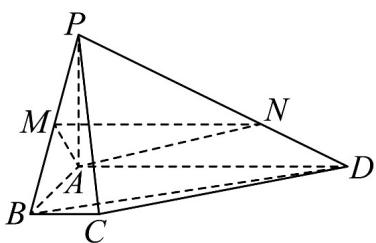

<!-- question-source:start -->
17. 如图，在四棱锥 $P - ABCD$ 中， $PA \perp$ 平面 $ABCD$ ， $AD \perp AB$ ， $AD \parallel BC$ ， $AD = 4$ ， $AB = AP = 2$

BC=1，M为PB的中点， $PN=2ND$

(1)证明： $PC\bot BD$

(2)若 $Q$ 为线段 $PC$ 上一点，且 $A, M, Q, N$ 四点共面，求三棱锥 $Q - ABC$ 的体积.
<!-- question-source:end -->

![[高中/课堂同步/题库/人教A版高中数学同步讲义(2026)/04_选择性必修第二册/期末/专题04 空间向量的应用高频题型精准突破（五大题型）（高效培优期末专项训练）/专题04_空间向量的应用_五大题型/questions/answers/Q00081011A1.md]]
