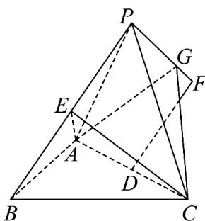

<!-- question-source:start -->
36. 如图，在三棱锥 $P - ABC$ 中， $AB \perp BC, AB = BC = 2\sqrt{6}, PA = PB = PC = 4$ ，且 $D, E$ 分别为 $AC, PB$ 的中点。点 $F$ 满足 $\frac{DF}{2} = \frac{1}{2}BP$ ， $G$ 为线段 $PF$ 上的动点。

(1)求证： $AC\bot PB$

(2)当 $CG$ 与平面 $AEC$ 所成角取得最大值时，求 $PG$ ；

(3)若二面角 $E - AC - G$ 的余弦值为 $\frac{\sqrt{7}}{14}$ ，求 $PG$ 。
<!-- question-source:end -->

![[高中/课堂同步/题库/人教A版高中数学同步讲义(2026)/04_选择性必修第二册/期末/专题04 空间向量的应用高频题型精准突破（五大题型）（高效培优期末专项训练）/专题04_空间向量的应用_五大题型/questions/answers/Q00081027A1.md]]
