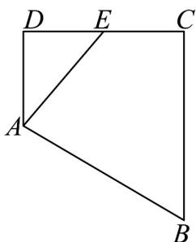
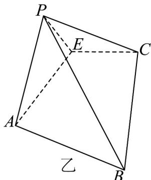

<!-- question-source:start -->
45. 如图甲，在梯形 $ABCD$ 中， $AD \parallel BC$ ， $\angle ADC = 90^\circ$ ， $BC = CD = 2AD = 4$ ， $E$ 是 $CD$ 的中点，将 $VADE$ 沿 $AE$ 折起，使点 $D$ 到达点 $P$ 的位置，如图乙，且 $PC = 2\sqrt{3}$ .

甲

(1)求证：平面 $PAE \perp$ 平面ABCE；

(2)求点 E 到平面 PBC 的距离.
<!-- question-source:end -->

![[高中/课堂同步/题库/人教A版高中数学同步讲义(2026)/04_选择性必修第二册/期末/专题04 空间向量的应用高频题型精准突破（五大题型）（高效培优期末专项训练）/专题04_空间向量的应用_五大题型/questions/answers/Q00081036A1.md]]
