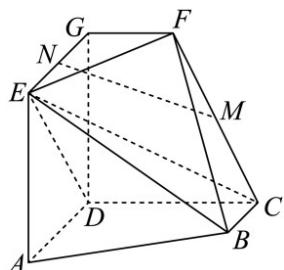

<!-- question-source:start -->
47. 如图， $AD \parallel BC$ 且 $AD = 2BC$ ， $AD \perp CD$ ， $EG \parallel AD$ 且 $EG = AD$ ， $CD \parallel FG$ 且 $CD = 2FG$ ， $DG \perp$ 平面 $ABCD$ ， $DA = DC = DG = 2\ldots$

(1)若 M 为 CF 的中点，N 为 EG 的中点，求证： $MN \parallel$ 平面 CDE；

(2)求点 $F$ 到线段 $EB$ 的距离.
<!-- question-source:end -->

![[高中/课堂同步/题库/人教A版高中数学同步讲义(2026)/04_选择性必修第二册/期末/专题04 空间向量的应用高频题型精准突破（五大题型）（高效培优期末专项训练）/专题04_空间向量的应用_五大题型/questions/answers/Q00081038A1.md]]
