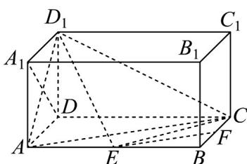

<!-- question-source:start -->
50．如图，在长方体 $ABCD-A_{1}B_{1}C_{1}D_{1}$ 中， $AD=AA_{1}=1, AB=2$ ，点 E 在棱 AB 上移动，点 F 是棱 BC 的中点.

(1)求证： $D_{1}E\perp A_{1}D$

(2)当 E 为 AB 中点时，求直线 EF 到平面 $ACD_{1}$ 的距离；

(3)当 $AE$ 等于何值时，平面 $D_{1}EC$ 与平面 $ECD$ 所成的角最小？
<!-- question-source:end -->

![[高中/课堂同步/题库/人教A版高中数学同步讲义(2026)/04_选择性必修第二册/期末/专题04 空间向量的应用高频题型精准突破（五大题型）（高效培优期末专项训练）/专题04_空间向量的应用_五大题型/questions/answers/Q00081041A1.md]]
