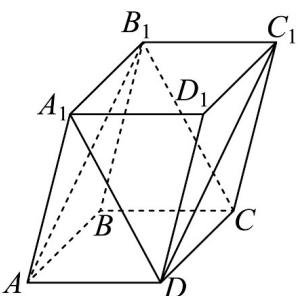

> [!faq]- 《专题04 空间向量的应用高频题型精准突破（五大题型）（高效培优期末专项训练）》官方解析
>
> > [!success]- **【答案】** A
>
> > [!note]- **【分析】**
> > 根据空间向量的基本定理易得 $DC_{1} = AB + AA_{1}$ ， $B_{1}C = AD - AA_{1}$ ，进而结合空间向量夹角公式求解即可·
>
> > [!note]- **【解析】**
> > 以 $AB, AD, AA_{1}$ 为基底，则 $DC_{1} = AB_{1} = AB + AA_{1}$ ， $B_{1}C = A_{1}D = AD - AA_{1}$
> >
> > $$
> > \left| \overline {{D C _ {1}}} \right| = \sqrt {\overline {{A B}} ^ {2} + 2 A B \cdot A A _ {1} + A A _ {1} ^ {2}} = \sqrt {1 ^ {2} + 2 \times 1 \times 2 \times \cos 6 0 ^ {\circ} + 2 ^ {2}} = \sqrt {7}
> > $$
> >
> > $$
> > \left| \overline {{B _ {1} C}} \right| = \sqrt {\overline {{A D}} ^ {2} - 2 A D \cdot \overline {{A A _ {1}}} + \overline {{A A _ {1}}} ^ {2}} = \sqrt {1 ^ {2} - 2 \times 1 \times 2 \times \cos 6 0 ^ {\circ} + 2 ^ {2}} = \sqrt {3}
> > $$
> >
> > $$
> > D C _ {1} \cdot B _ {1} C = \left( \begin{array}{c c} U U U & U U U \\ A B + A A _ {1} \end{array} \right) \cdot \left( \begin{array}{c c} U U U & U U U \\ A D - A A _ {1} \end{array} \right) = A B \cdot A D - A B \cdot A A _ {1} + A A _ {1} \cdot A D - A A _ {1} ^ {2}
> > $$
> >
> > $$
> > = 1 \times 1 \times \cos 6 0 ^ {\circ} - 1 \times 2 \times \cos 6 0 ^ {\circ} + 2 \times 1 \times \cos 6 0 ^ {\circ} - 2 ^ {2} = - \frac {7}{2}
> > $$
> >
> > 所以 $\cos\left\langle\overrightarrow{DC_{1}},\overrightarrow{B_{1}C}\right\rangle=\frac{\overrightarrow{DC_{1}}\cdot\overrightarrow{B_{1}C}}{\left|\overrightarrow{DC_{1}}\right|\left|\overrightarrow{B_{1}C}\right|}=\frac{-\frac{7}{2}}{\sqrt{7}\times\sqrt{3}}=-\frac{\sqrt{21}}{6}$
> >
> > 则直线 $DC_{1}, B_{1}C$ 所成角的余弦值为 $\frac{\sqrt{21}}{6}$ .
> >
> > 故选：A.
> >
> > 
> >
> > 5. 平面 $\alpha, \beta$ 的法向量分别为 $m = (a, 1, -2), n = (1, -2, b)$ ，请在① $\alpha \parallel \beta$ ，② $\alpha \perp \beta$ 中选择一个填在横线上，并写出答案，若选 \_\_\_\_，则 $a - 2b =$ \_\_\_\_。
> >
> > 【答案】 答案见解析 答案见解析
> >
> > 【分析】根据平面的位置关系，可判度它们的法向量平行或垂直，结合向量的坐标运算，即可求得答案·
> >
> > 【详解】若选①：由 $\alpha\parallel\beta$ ，得 $m//n$ ，显然 $a\neq0, b\neq0$ ，则 $\frac{a}{1}=\frac{1}{-2}=\frac{-2}{b}$
> >
> > 解得 $a = -\frac{1}{2}, b = 4, \therefore a - 2b = -\frac{17}{2}$
> >
> > 若选②：由 $\alpha \perp \beta$ ，得 $m\perp n$ ，则 $m\cdot n = 0$ ，则 $a - 2 - 2b = 0,$
> >
> > 解得 $a - 2b = 2$
> >
> > 故答案为：①， $-\frac{17}{2}$ ；或②， $^{2}$
