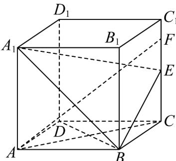
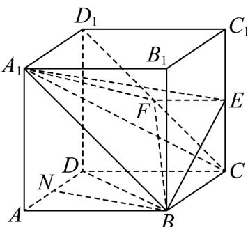
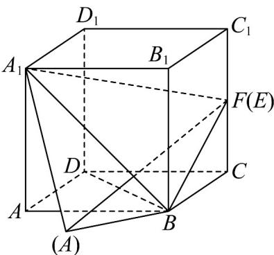
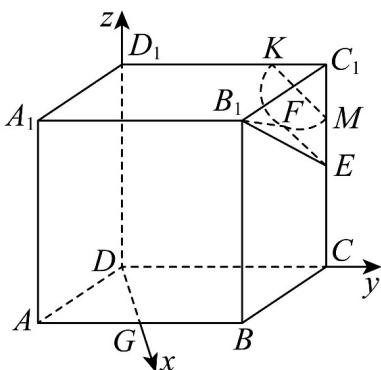

> [!faq]- 《专题04 空间向量的应用高频题型精准突破（五大题型）（高效培优期末专项训练）》官方解析
>
> > [!success]- **【答案】**  A. 若 $\lambda = 1$ ，则 $AF \perp BD$ B．若 $\lambda + \mu = 1$ ，则四面体 $A_{1} - BEF$ 的体积是定值 C. 若 $\lambda = 1$ ， $\mu = \frac{1}{2}$ ，则存在点 $P \in A_1B$ ，使得 $AP + PF$ 的最小值为 $9 + 2\sqrt{10}$ D．若 $B_{1}F\perp EF$ ，则点F的轨迹长为 $\frac{\sqrt{2}}{2}\pi$
>
> > [!note]- **【分析】**
> > 若 $\lambda=1$ ，则 F 在 $CC_{1}$ 上，利用线面垂直的判定定理、性质定理可判断 A；若 $\lambda+\mu=1$ ，则 F, C, $D_{1}$ 三点共线，利用线面平行的判定定理得出 $CD_{1}//$ 平面 $A_{1}BE$ ，得 $CD_{1}$ 上的点到平面 $A_{1}BE$ 的距离都相等，再由 $V_{A_{1}-BEF}=V_{F-A_{1}BE}=V_{C-A_{1}BE}=V_{A_{1}-BCE}$ ，可判断 B；若 $\lambda=1$ ， $\mu=\frac{1}{2}$ ，则点 F 与 E 点重合，把 $\triangle A_{1}AB$ 沿着 $A_{1}B$ 进行翻折，使得 $A_{1}, A, B_{1}, F$ 四点共面，此时 $AP+PF$ 有最小值 AF，由余弦定理可判断 C；取 AB 的中点 G，以 D 为原点，分别以 DG, DC, $DD_{1}$ 所在的直线为 x, y, z 轴建立空间直角坐标系，设 $F(0, y, z)$ 利用 $B_{1}F \cdot EF = 0$ 可判断 D 正确.
>
> > [!note]- **【解析】**
> > 对于 A，若 $\lambda=1$ ，则 $DF-DC=CF=\mu DD_{1}$ ，即 F 在 $CC_{1}$ 上，连接 AF, BD, AC，因为底面 ABCD 是菱形，所以 $AC \perp BD$ ，因为 $CC_{1} \perp$ 底面 ABCD， $BD \subset$ 平面 ABCD，所以 $CC_{1} \perp BD$ ，又 $AC \cap CC_{1}=C$ ， $AC, CC_{1} \subset$ 平面 ACF，所以 $BD \perp$ 平面 ACF， $AF \subset$ 平面 ACF，所以 $AF \perp BD$ ，故 A 正确；
> >
> > 
> >
> > 对于 B，若 $\lambda + \mu = 1$ ，则 F, C, $D_{1}$ 三点共线，连接 $CD_{1}, A_{1}F, BF, EF, A_{1}C$
> >
> > 因为 $A_{1}D_{1} / / BC, A_{1}D_{1} = BC$ ，所以四边形 $A_{1}D_{1}CB$ 是平行四边形， $A_{1}B / / CD_{1}$
> >
> > 因为 $CD_{1} \notin$ 平面 $A_{1}BE$ ， $A_{1}B \subset$ 平面 $A_{1}BE$ ，所以 $CD_{1} //$ 平面 $A_{1}BE$
> >
> > 可得 $CD_{1}$ 上的点到平面 $A_{1}BE$ 的距离都相等，
> >
> > 可得 $V_{A_1 - BEF} = V_{F - A_1BE} = V_{C - A_1BE} = V_{A_1 - BCE}$ ，取 $AD$ 的中点 $N$ ，连接 $BN,BD$
> >
> > 又 $A_{1}A \perp$ 平面ABCD， $BN \subset$ 平面ABCD，所以 $A_{1}A \perp BN$ ，又 $A_{1}A \cap AD = A$
> >
> > 可得 $\triangle ABD$ 是边长为 $2$ 的等边三角形， $BN \perp AD$
> >
> > $A_{1}A, AD \subset$ 平面 $A_{1}D_{1}DA$ ，可得 $BN \perp$ 平面 $A_{1}D_{1}DA$
> >
> > $BN \perp$ 平面 $B_{1}C_{1}CB$ ，因为 $S_{\triangle BCE} = \frac{1}{2} BC \times CE = 1$
> >
> > $V_{A_{1}-BCE}=\frac{1}{3}S_{\triangle BCE}\times BN=\frac{1}{2}\times\sqrt{3}=\frac{\sqrt{3}}{2}$ ，可得 $V_{A_{1}-BEF}=\frac{\sqrt{3}}{2}$ ，故B正确；
> >
> > 
> >
> > 对于 $\mathbb{C}$ ，若 $\lambda = 1$ ， $\mu = \frac{1}{2}$ ，则 $DF = DC + \frac{1}{2} DD_{1}$ ，即 $DF - DC = CF = \frac{1}{2} DD_{1}$
> >
> > 即点 $F$ 与 $E$ 点重合，把 $\triangle A_{1}AB$ 沿着 $A_{1}B$ 进行翻折，使得 $A_{1}, A, B_{1}, F$ 四点共面，
> >
> > 此时 $AP + PF$ 有最小值 $AF$ ，在 $\triangle A_{1}FB$ 中， $A_{1}A = \sqrt{13}, BF = \sqrt{5}, A_{1}B = 2\sqrt{2}$
> >
> > 所以 $A_{1}F^{2} = A_{1}B^{2} + BF^{2}$ ，所以 $\angle A_1BF = \frac{\pi}{2}$ ，所以 $\angle ABF = \frac{3\pi}{4}$ 在 $\triangle AFB$ 中，由余弦定理得 $\cos \angle ABF = \frac{AB^2 + BF^2 - AF^2}{2AB\times BF} = \frac{4 + 5 - AF^2}{4\sqrt{5}} = -\frac{\sqrt{2}}{2}$ ，解得 $AF = \sqrt{9 + 2\sqrt{10}}$ ，故C错误；
> >
> > 
> >
> > 对于 $^{D}$ ，取AB的中点G，连接DG，AD=2,AG=1, $\angle DAB=\frac{\pi}{3}$ ，
> >
> > $$
> > D G = \sqrt {3}
> > $$
> >
> > $$
> > D G \perp A B
> > $$
> >
> > $$
> > D G, D C, D D _ {1}
> > $$
> >
> > $$
> > x, y, z
> > $$
> >
> > $$
> > F (0, y, z) \quad B _ {1} (\sqrt {3}, 1, 2), E (0, 2, 1)
> > $$
> >
> > $$
> > \stackrel {\sqcup \sqcup \sqcup} {B _ {1} F} = (- \sqrt {3}, y - 1, z - 2), \stackrel {\sqcup \sqcup \sqcup} {E F} = (0, y - 2, z - 1)
> > $$
> >
> > 因为 $B_{1}F \perp EF$ ，所以 $\overline{B_{1}F} \cdot \overline{EF} = (y - 1)(y - 2) + (z - 1)(z - 2) = 0$
> >
> > 即 $\left(y - \frac{3}{2}\right)^2 +\left(z - \frac{3}{2}\right)^2 = \frac{1}{2}$ ，可得点 $F$ 的轨迹是在平面 $DCC_{1}D_{1}$ 内，以 $\left(0,\frac{3}{2},\frac{3}{2}\right)$ 为圆心， $\frac{\sqrt{2}}{2}$ 为半径的半圆，且 $C_1K = C_1M = \frac{1}{2}$ ，所以点 $F$ 的轨迹长为 $2\pi \times \frac{\sqrt{2}}{2}\times \frac{1}{2} = \frac{\sqrt{2}}{2}\pi$ ，故D正确·
> >
> > 
> >
> > 故选 **ABD**.
