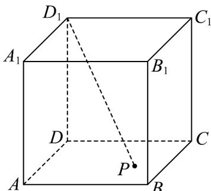
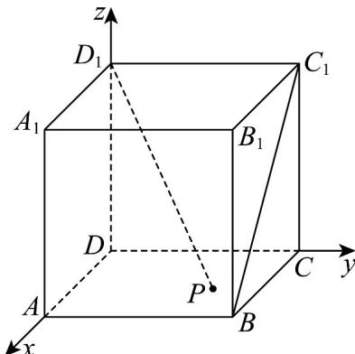
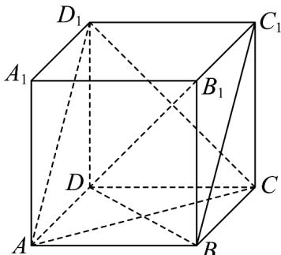
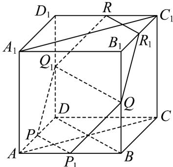

> [!faq]- 《专题04 空间向量的应用高频题型精准突破（五大题型）（高效培优期末专项训练）》官方解析
>
> > [!success]- **【答案】**  A．三棱锥 $B_{1} - A_{1}D_{1}P$ 的体积为定值 B．存在点 P，使得 $D_{1}P \perp BC_{1}$ C．若 $D_{1}P \perp B_{1}D$ ，则 P 点在正方形 ABCD 内的运动轨迹长度为 $2\sqrt{2}$ D．若点 P 为 AD 的中点，点 Q 为 $BB_{1}$ 的中点，过 P，Q 作平面 $\alpha \perp$ 平面 $ACC_{1}A_{1}$ ，则平面 $\alpha$ 截正方体 $ABCD - A_{1}B_{1}C_{1}D_{1}$ 所得截面的面积为 $3\sqrt{3}$
>
> > [!note]- **【分析】**
> > 利用等体积法判断 $^{A}$ ；建立空间直角坐标系，利用空间向量数量积判断 $^{B}$ ；确定轨迹并求出长度判断 $^{C}$ ；作出符合要求的正方体的截面并求出面积判断 $^{D}$ .
>
> > [!note]- **【解析】**
> > 对于 A，在正方体 $ABCD - A_{1}B_{1}C_{1}D_{1}$ 中，平面 $ABCD \parallel$ 平面 $A_{1}B_{1}C_{1}D_{1}$
> >
> > 则点 P 到平面 $A_{1}B_{1}C_{1}D_{1}$ 距离为定值， $\triangle A_{1}B_{1}D_{1}$ 的面积为定值， $V_{B_{1}-A_{1}D_{1}P}=V_{P-A_{1}D_{1}B_{1}}$ 为定值，A 正确；
> >
> > 对于 $^{B}$ ，建立如图所示的空间直角坐标系，则 $B(2,2,0), C_{1}(0,2,2), D_{1}(0,0,2)$
> >
> > 
> >
> > 设 $P(x,y,0)(x,y\in [0,2])$ ， $\overline{D_1P} = (x,y, - 2),\overline{BC_1} = (-2,0,2)$ ， $\overline{D_1P}\cdot \overline{BC_1} = -2x - 4\leq -4$
> >
> > $D_{1}P, BC_{1}$ 不垂直，因此不存在点 $P$ ，使 $D_{1}P \perp AD_{1}$ ，B错误；
> >
> > 对于 $C$ ，连接 $DB$ ， $BB_{1} \perp$ 平面 $ABCD$ ， $AC \subset$ 平面 $ABCD$ ，则 $AC \perp BB_{1}$ ，而 $AC \perp DB$
> >
> > 又 $DB \cap BB_{1} = B, DB, BB_{1} \subset$ 平面 $DBB_{1}$ ，则 $AC \perp$ 平面 $DBB_{1}$ ，又 $DB_{1} \subset$ 平面 $DBB_{1}$ ，则 $AC \perp DB_{1}$ .
> >
> > 同理得 $AD_{1} \perp DB_{1}$ ，又 $AD_{1} \cap AC = A, AD_{1}, AC \subset$ 平面 $D_{1}AC$ ，则 $B_{1}D \perp$ 平面 $D_{1}AC$
> >
> > 由 $D_{1}P \perp B_{1}D$ ，得 $D_{1}P \subset$ 平面 $D_{1}AC$ ，又 $P \in$ 平面ABCD，因此点 $P$ 轨迹为平面 $D_{1}AC$
> >
> > 与底面 ABCD 交线，即为线段 AC，又 $AC = 2\sqrt{2}$ ，C 正确；
> >
> > 
> >
> > 对于 D，取 AB 中点为 $P_{1}$ ，连接 $PP_{1}$ ， $DB \perp AC, AA_{1} \perp$ 平面 ABCD，
> >
> > 由 $PP_{1}$ 平行于 $DB$ ， $PP_{1} \subset$ 平面 $ABCD$ ，得 $PP_{1} \perp AC, PP_{1} \perp AA_{1}$ ，又 $AC \cap AA_{1} = A$ ，则 $PP_{1} \perp$ 平面 $ACC_{1}A_{1}$ ，又取 $DD_{1}$ 中点为 $Q_{1}$ ，则 $QQ_{1} // DB // PP_{1}$ ，有 $P, P_{1}, Q, Q_{1}$ 四点共面，则平面 $PP_{1}QQ_{1} \perp$ 平面 $ACC_{1}A_{1}$ .
> >
> > 平面 $PP_{1}QQ_{1}$ 即为平面 $\alpha$ ，设平面 $\alpha$ 分别与 $D_{1}C_{1}, B_{1}C_{1}$ 交于 $R, R_{1}$
> >
> > 由平面 $ADD_{1}A_{1} / /$ 平面 $BCC_{1}B_{1}$ ，平面 $ADD_{1}A_{1}\cap \alpha = PQ_{1}$ ，平面 $BCC_{1}B_{1}\cap \alpha = QR_{1}$
> >
> > 则 $PQ_{1} / / QR_{1}$ ，又 $P,Q,Q_{1}$ 都是中点，则 $R_{1}$ 是 $B_{1}C_{1}$ 中点，同理 $R$ 是 $D_{1}C_{1}$ 中点，于是平面 $\alpha$ 截正方体 $ABCD - A_{1}B_{1}C_{1}D_{1}$ 所得截面为正六边形，又正方体棱长为 $2$ ，则 $PP_{1} = \sqrt{2}$ 所以截面面积为 $6\times \frac{\sqrt{3}}{4}\times (\sqrt{2})^{2} = 3\sqrt{3}$ ，D正确.
> >
> > 
> >
> > 故选 **ACD**
