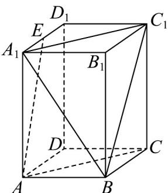
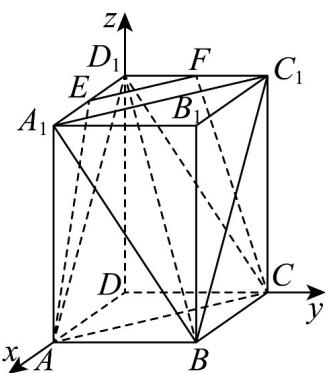

> [!faq]- 《专题04 空间向量的应用高频题型精准突破（五大题型）（高效培优期末专项训练）》官方解析
>
> > [!success]- **【答案】**  A. $\Omega$ 的面积为 $\frac{3\sqrt{33}}{8}$ B. $\Omega$ 的面积为 $\frac{3\sqrt{35}}{8}$ C．当 $\lambda=\frac{1}{2}$ 时，存在点 $P$ ，使得 $A_{1}P\perp BD_{1}$ D．当 $\mu=1$ 时，三棱锥 P-ABC 的体积为定值
>
> > [!note]- **【分析】**
> > 根据中点以及线线平行可得 P 的轨迹为四边形 AEFC，即可利用梯形面积求解 AB，建立空间直角坐标系，根据向量的坐标运算即可求解 C，利用线面平行，结合体积公式即可求解 D.
>
> > [!note]- **【解析】**
> > 取 $C_{1}D_{1}$ 的中点F，连接EF,FC则 $EF//AC$ ，
> >
> > 所以 A, E, F, C 四点共面·因为 $\overline{AP} = \lambda \overline{AC} + \mu \overline{AE}$
> >
> > 所以 A, C, E, P 四点共面，故点 P 的轨迹为四边形 AEFC，所以 $\Omega$ 的面积即为梯形 AEFC 的面积.
> >
> > 因为 $EF = \frac{\sqrt{2}}{2}$ ， $AC = \sqrt{2}$ ， $AE = CF = \frac{\sqrt{17}}{2}$ ，所以 $S_{\Omega} = \frac{1}{2}\left(\frac{\sqrt{2}}{2} +\sqrt{2}\right)\times \sqrt{\left(\frac{\sqrt{17}}{2}\right)^2 - \left[\frac{1}{2}\left(\sqrt{2} -\frac{\sqrt{2}}{2}\right)\right]^2} = \frac{3\sqrt{33}}{8}$
> >
> > 故 A 正确，B 错误.
> >
> > 对于 $^{C}$ ，如图，建立空间直角坐标系，则 $A(1,0,0)$ ， $A_{1}(1,0,2)$ ，
> >
> > $B(1,1,0)$ ， $D_{1}(0,0,2)$ ， $E\left(\frac{1}{2},0,2\right)$ ， $C(0,1,0)$
> >
> > 因为 $\overline{AP}=\frac{1}{2}\overline{AC}+\overline{\mu AE}$ ，所以 $P\left(\frac{1}{2}-\frac{1}{2}\mu,\frac{1}{2},2\mu\right)$ ，所以 $\overline{A_{1}}P=\left(-\frac{1}{2}-\frac{1}{2}\mu,\frac{1}{2},2\mu-2\right)$ .
> >
> > 因为 $\overline{BD}_{1}=(-1,-1,2)$ ，所以 $\overline{A_{1}P}\cdot\overline{BD_{1}}=\frac{1}{2}+\frac{1}{2}\mu-\frac{1}{2}+4\mu-4=0$ ，
> >
> > 得 $\mu = \frac{8}{9}$ ，所以存在点 $P$ ，使得 $A_{1}P\perp BD_{1}$ ，故C正确·
> >
> > 对于 D，当 $\mu=1$ 时， $P\in EF$ ，因为 $EF//$ 平面 ABC，故点 P 到平面 ABC 的距离为定值 2，又三角形 ABC 的面积为定值，所以三棱锥 P-ABC 的体积为定值，所以 D 正确.
> >
> > 故选:ACD
> >
> > 
