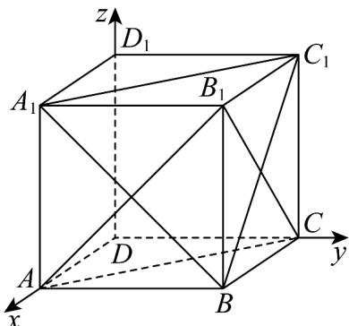
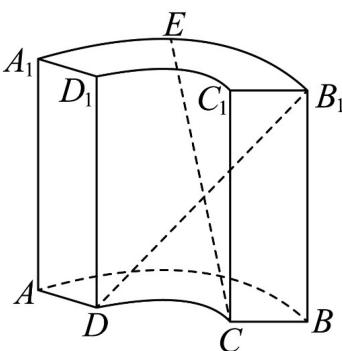
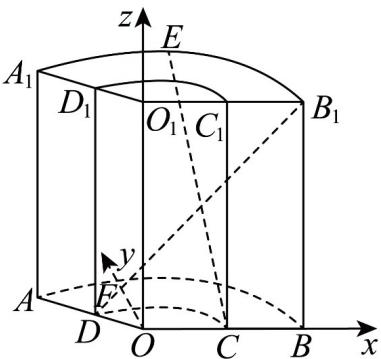

> [!faq]- 《专题04 空间向量的应用高频题型精准突破（五大题型）（高效培优期末专项训练）》官方解析
>
> > [!success]- **【答案】**  A. $l / /$ 平面 $AB_{1}C$ B. $l\bot AB$ C. $l$ 与 $BC_{1}$ 所成角大小为 $\frac{\pi}{3}$ D. $l \perp BD_{1}$
>
> > [!note]- **【分析】**
> > 建立空间直角坐标系，求出关键点的坐标和关键平面的法向量，再求出交线的方向向量，利用空
> >
> > 间位置关系的向量证明判断 A, B, D，利用线线角的向量求法判断 C 即可.
>
> > [!note]- **【解析】**
> > 如图，以 D 为原点建立空间直角坐标系，且设边长为 $^{2}$ ，
> >
> > 
> >
> > 则 $B_{1}(2,2,2)$ ， $A_{1}(2,0,2)$ ， $A(2,0,0)$ ， $C_1(0,2,2)$ ， $B(2,2,0)$ ， $C(0,2,0)$ ， $D_{1}(0,0,2)$
> >
> > 可得 $A_{1}C_{1} = (-2,2,0)$ ， $A_{1}B = (0,2, - 2)$
> >
> > 设平面 $A_{1}C_{1}B$ 的法向量为 $n = (x,y,z)$ ，得到 $\left\{ \begin{array}{l} n \cdot A_{1}C_{1} = -2x + 2y = 0 \\ n \cdot A_{1}B = 2y - 2z = 0 \end{array} \right.$
> >
> > 令 $x = 1$ ，解得 $y = 1, z = 1$ ，则 $n = (1, 1, 1)$
> >
> > 易得平面 ABCD 的法向量为 $m = (0, 0, 1)$ ,
> >
> > 而平面 $A_{1}C_{1}B$ 与平面 $ABCD$ 的交线为 $l$ ，可得 $\left\{ \begin{array}{ll}l\bot n\\ l\bot m \end{array} \right.$
> >
> > 设 $l$ 的方向向量为 $\stackrel{1}{s} = (a,b,c)$ ，则 $\left\{ \begin{array}{ll} s \cdot m = c = 0 \\ s \cdot n = a + b + c = 0 \end{array} \right.$
> >
> > 令 $a = 1$ ，解得 $b = -1$ ， $c = 0$ ，可得 $s = (1, - 1,0)$
> >
> > 而 $AB_{1}=(0,2,2)$ ， $AC=(-2,2,0)$ ，
> >
> > 设平面 $AB_{1}C$ 的法向量为 $t = (d,e,f)$ ，则 $\left\{ \begin{array}{l} t \cdot AB_{1} = 2e + 2f = 0 \\ t \cdot AC = -2d + 2e = 0 \end{array} \right.$ ，
> >
> > 令 $d = 1$ ，解得 $e = 1$ ， $f = -1$ ，可得 $t = (1,1, - 1)$
> >
> > 对于 $^{A}$ ，由已知得 $s\cdot t=1-1=0$ ，且由题意得 $B\in l$ ，
> >
> > 显然 B 不在面 $AB_{1}C$ 内，则 $l \parallel$ 平面 $AB_{1}C$ ，故 A 正确，
> >
> > 对于 BD，由 $\overline{AB} = (0, 2, 0)$ ， $\overline{BD}_{1} = (-2, -2, 2)$ ，则 $s \cdot \overline{AB} = -2 \neq 0$ ， $s \cdot \overline{BD}_{1} = -2 + 2 + 0 = 0$ ，则 $l \perp AB$ 不成立，
> >
> > $l \perp BD_{1}$ 成立，故 B 错误，D 正确，
> >
> > 对于 C，由题意得 $BC_{1}=(-2,0,2)$ ，设 l 与 $BC_{1}$ 所成角为 $\beta$ ，
> >
> > 则 $\cos\beta=\frac{\left|s\cdot BC_{1}\right|}{\left|s\right|\cdot\left|BC_{1}\right|}=\frac{\left|-2\right|}{\sqrt{2}\times2\sqrt{2}}=\frac{1}{2}$ ，而 $\beta\in\left(0,\frac{\pi}{2}\right]$ ，可得 $\beta=\frac{\pi}{3}$ ，故 C 正确.
> >
> > 故选：ACD
> >
> > 33. 中国古代数学著作《九章算术》中记载了一种被称为“曲池”的几何体。该几何体是上、下底面均为扇环形的柱体（扇环是指圆环被扇形截得的部分）。在如图所示的“曲池”中， $AA_{1} \perp$ 平面 $A_{1}B_{1}C_{1}D_{1}$ ，记弧 $AB$ 、弧 $DC$ 的长度分别为 $l_{1}, l_{2}$ ，已知 $AA_{1} = 3AD = 3, l_{1} = 2l_{2} = \frac{4\pi}{3}$ ， $E$ 为弧 $A_{1}B_{1}$ 的中点，则直线 $CE$ 与 $DB_{1}$ 所成角的余弦值为（）
> >
> > 【答案】
> >
> > 
> >
> > A. $\frac{\sqrt{181}}{16}$ B. $\frac{5\sqrt{3}}{16}$ C. $\frac{5\sqrt{2}}{12}$ D. $\frac{\sqrt{94}}{12}$
> >
> > 【答案】B
> >
> > 【分析】建立空间直角坐标系，以向量法去求解异面直线 $CE$ 与 $DB_{1}$ 所成角的余弦值·
> >
> > 【详解】设上底面圆心为 $O_{1}$ ，下底面圆心为 $O$ ，连接 $OO_{1}, O_{1}D_{1}, O_{1}C_{1}$ ， $OD, OC$
> >
> > 在下底面作 $OF \perp OD$
> >
> > 以 O 为原点，分别以 OD, OF, $OO_{1}$ 所在直线为 x 轴，y 轴，z 轴建立空间直角坐标系，如图：
> >
> > 
> >
> > 因为 $AA_{1}=3AD=3$ ， $l_{1}=2l_{2}=\frac{4\pi}{3}$ ，所以扇环对应的两个圆的半径之比为 1:2，
> >
> > $AD = 1$ ，所以 $\frac{OD}{OA} = \frac{1}{2}$ ，得 $OD = 1, OA = 2$
> >
> > 则 $D(\cos \frac{2\pi}{3},\sin \frac{2\pi}{3},0)$ 即 $D(-\frac{1}{2},\frac{\sqrt{3}}{2},0)$ ， $E\left(2\cos \frac{\pi}{3},2\sin \frac{\pi}{3},3\right)$ 即 $E(1,\sqrt{3},3)$ ，
> >
> > $C(1,0,0)$ ， $E(1,\sqrt{3},3),B_{1}(2,0,3)$ ， $\overrightarrow{CE} = (0,\sqrt{3},3)$ ， $\overrightarrow{DB_1} = (\frac{5}{2}, - \frac{\sqrt{3}}{2},3)$ ， $\left|\overrightarrow{CE}\right| = \sqrt{3 + 9} = 2\sqrt{3}$
> >
> > $$
> > \left| \overrightarrow {B _ {1} D} \right| = \sqrt {\frac {2 5}{4} + \frac {3}{4} + 9} = 4
> > $$
> >
> > $\overrightarrow{CE} \cdot \overrightarrow{DB_{1}} = \frac{5}{2} \times 0 + \left( -\frac{\sqrt{3}}{2} \right) \times \sqrt{3} + 3 \times 3 = \frac{15}{2}.$
> >
> > 所以 $\cos\left\langle\overrightarrow{CE},\overrightarrow{DB_{1}}\right\rangle=\frac{\overrightarrow{CE}\cdot\overrightarrow{DB_{1}}}{|\overrightarrow{CE}||\overrightarrow{DB_{1}}|}=\frac{\frac{15}{2}}{2\sqrt{3}\times4}=\frac{5\sqrt{3}}{16}$
> >
> > 又异面直线所成角的范围为 $\left(0, \frac{\pi}{2}\right]$ ，故异面直线 $CE$ 与 $DB_{1}$ 所成角的余弦值为 $\frac{5\sqrt{3}}{16}$
> >
> > 故选 **B**.
