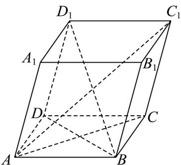

> [!faq]- 《专题04 空间向量的应用高频题型精准突破（五大题型）（高效培优期末专项训练）》官方解析
>
> > [!success]- **【答案】**  A. $AC_{1} = \sqrt{6}$ B. $AC_{1} \perp BD$ C. 向量 $AA_{1}$ 与 $B_{1}C$ 的夹角是 $120^{\circ}$ D. $BD_{1}$ 与 AC 所成角的余弦值为 $\frac{\sqrt{6}}{3}$
>
> > [!note]- **【分析】**
> > 根据给定条件，取空间向量的一个基底，利用空间向量的线性运算和数量积运算，逐项求解判断
>
> > [!note]- **【解析】**
> > 在平行六面体 $ABCD - A_{1}B_{1}C_{1}D_{1}$ 中， $\{AA_1,AB,AD\}$ 为空间的一个基底，
> >
> > $$
> > | \stackrel {{\text {   ①   }}} {{A B}} | = | \stackrel {{\text {   ②   }}} {{A D}} | = | \stackrel {{\text {   ③   }}} {{A A _ {1}}} | = 1, \left\langle A B, A D \right\rangle = \left\langle A B, A A _ {1} \right\rangle = \left\langle A D, A A _ {1} \right\rangle = 6 0 ^ {\circ}
> > $$
> >
> > $AA_{1} \cdot AB = AA_{1} \cdot AD = AD \cdot AB = 1 \times 1 \times \cos 60^{\circ} = \frac{1}{2}$
> >
> > 对于 A， $AC_{1}=\overline{AB}+\overline{AD}+\overline{AA}_{1}$ ， $|AC_{1}|=\sqrt{(AB+AD+AA_{1})^{2}}$
> >
> > $= \sqrt{AB^{2} + AD^{2} + AA_{1}^{2} + 2AB\cdot AD + 2AA_{1}\cdot AB + 2AA_{1}\cdot AD} = \sqrt{1 + 1 + 1 + 3\times 2\times\frac{1}{2}} = \sqrt{6}$ ，A正确；
> >
> > 对于 B， $BD = AD - AB$ ，则 $AC_{1} \cdot BD = (AB + AD + AA_{1}) \cdot (AD - AB)$
> >
> > $= \overline{A}D^{2}-\overline{A}B^{2}+\overline{A}D\cdot\overline{A}A_{1}-\overline{A}B\cdot\overline{A}A_{1}=0$ ，因此 $AC_{1}\perp BD$ ，B正确；
> >
> > 对于 $C$ ， $\overline{B_1C} = \overline{B_1C_1} +\overline{B_1B} = \overline{AD} -\overline{AA_1}$ ，则 $\left|\overline{B_1C}\right| = \sqrt{\overline{AD}^2 + AA_1^2 - 2AD\cdot AA_1} = \sqrt{1 + 1 - 1} = 1$
> >
> > $$
> > \cos \left\langle B _ {1} C, A A _ {1} \right\rangle = \frac {\square \square \square \square \square \square \square \square \square \square \square \square \square \square \square \square \square \square \square}{| B _ {1} C | | A A _ {1} |} = \frac {(A D _ {1} \square \square \square \square \square \square \square \square \square) ^ {2} A A _ {1}}{| B _ {1} C | | A A _ {1} |} = \frac {\frac {1}{2} - 1}{1 \times 1} = - \frac {1}{2}, \text {而} 0 ^ {\circ} \leq \left\langle B _ {1} C, A A _ {1} \right\rangle \leq 1 8 0 ^ {\circ},
> > $$
> >
> > 因此向量 $B_{1}C$ 与 $AA_{1}$ 夹角是 $120^{\circ}$ ，C 正确；
> >
> > 对于 D， $BD_{1}=AD+AA_{1}-AB,AC=AB+AD$ ，则 $BD_{1}\cdot AC=(AD+AA_{1}-AB)\cdot(AB+AD)$
> >
> > $= \overline{AD}^{2} - \overline{AB}^{2} + \overline{AA}_{1} \cdot \overline{AB} + \overline{AA}_{1} \cdot \overline{AD} = 1$ ，而 $|BD_{1}| = \sqrt{(AD + AA_{1} - AB)^{2}}$
> >
> > $$
> > = \sqrt {1 + 1 + 1 + 2 \times \frac {1}{2} - 2 \times \frac {1}{2} - 2 \times \frac {1}{2}} = \sqrt {2}, | \overrightarrow {A C} | = \sqrt {\left(A B + A D\right) ^ {2}} = \sqrt {1 + 2 \times \frac {1}{2} + 1} = \sqrt {3},
> > $$
> >
> > $\cos \left\langle BD_{1}, AC \right\rangle = \frac{BD_{1} \cdot AG}{\left| BD_{1} \right|\left| AC \right|} = \frac{1}{\sqrt{2} \times \sqrt{3}} = \frac{\sqrt{6}}{6}$ ，D 错误.
> >
> > 故选 **ABC**
