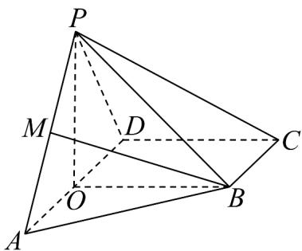
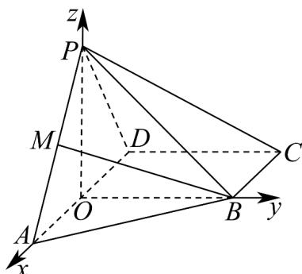

> [!faq]- 《专题04 空间向量的应用高频题型精准突破（五大题型）（高效培优期末专项训练）》官方解析
>
> > [!success]- **【答案】** (1)证明见解析 (2) $\frac{\sqrt{7}}{7}$ (3) $\frac{\sqrt{3}}{2}$
>
> > [!note]- **【分析】**
> > （1）结合余弦定理 $PO$ 的值，再由勾股定理可得 $PO \perp AD$ ，根据面面垂直的性质定理即可证明线面垂直；
> >
> > (2) 以 $O$ 为原点， $OA$ 为 $x$ 轴， $OB$ 为 $y$ 轴， $OP$ 为 $z$ 轴，建立空间直角坐标系，利用空间向量的坐标运算求解面 $APB$ 与面 $PBC$ 的法向量，从而可得面面夹角的余弦值，利用平方公式得正弦值；
> >
> > （3）设 $\overline{AM}=\lambda\overline{AP}$ ，确定 $\overline{BM}$ 的坐标，利用空间向量线面夹角公式求解即可·
>
> > [!note]- **【解析】**
> > （1）因为 $BO \perp AD$ ， $BC // AD$ ， $\angle ADC = \angle BCD = 90^{\circ}$
> >
> > 
> >
> > 所以四边形 BODC 为矩形，
> >
> > 在 $^{\triangle }PDO$ 中，PD=2，DO=BC=1， $\angle PDA=60^{\circ}$ ，
> >
> > 则 $PO = \sqrt{PD^2 + OD^2 - 2PD\cdot OD\cos 60^\circ} = \sqrt{3}$
> >
> > 所以 $PO^{2} + DO^{2} = PD^{2}$ ，则 $PO \perp AD$
> >
> > 且平面 $PAD \perp$ 平面 $ABCD$ ， $PO \subset$ 平面 $PAD$ ，平面 $PAD \cap$ 平面 $ABCD = AD$
> >
> > 所以 $PO \perp$ 平面 ABCD；
> >
> > (2) 以 O 为原点，OA 为 x 轴，OB 为 y 轴，OP 为 z 轴，建立空间直角坐标系，
> >
> > 
> >
> > 因为 $PO = \sqrt{3}$ ， $\angle PAD = 30^{\circ}$ ，可得 $AO = 3$ ，则 $O(0,0,0)$ ， $A(3,0,0)$ ， $P\left(0,0,\sqrt{3}\right)$ ， $B\left(0,\sqrt{3},0\right)$ ， $C(-1,\sqrt{3},0)$
> >
> > 设平面 $APB$ 的法向量为 $m = (x,y,z)$ ， $\overline{PA} = \left(3,0, - \sqrt{3}\right)$ ， $\overline{PB} = \left(0,\sqrt{3}, - \sqrt{3}\right)$
> >
> > 由 $\left\{\begin{aligned}\overrightarrow{PA}\cdot m&=3x-\sqrt{3}z=0\\ \overrightarrow{PB}\cdot m&=\sqrt{3}y-\sqrt{3}z=0\end{aligned}\right.\Rightarrow\left\{\begin{aligned}z&=\sqrt{3}x\\ y&=z\end{aligned}\right.$ ，取 $m=\left(1,\sqrt{3},\sqrt{3}\right)$
> >
> > 设平面 CPB 的法向量为 $n = (a, b, c)$ ， $PC = (-1, \sqrt{3}, -\sqrt{3})$ ，
> >
> > 由 $\left\{\begin{aligned}n\cdot PB&=\sqrt{3}b-\sqrt{3}c=0\\ \rightarrow PP&\\ n\cdot PC&=-a+\sqrt{3}b-\sqrt{3}c=0\end{aligned}\right.\Rightarrow\left\{\begin{aligned}a&=0\\ b&=c\end{aligned}\right.$ ，取 $n=(0,1,1)$ ，
> >
> > $$
> > \cos \stackrel {\rightarrow} {m}, n = \frac {\underline {{m}} \cdot n}{| m | | n |} = \frac {2 \sqrt {3}}{\sqrt {7} \times \sqrt {2}} = \frac {\sqrt {4 2}}{7}
> > $$
> >
> > 又由图可知二面角 $A - PB - C$ 是钝角，
> >
> > 所以二面角 $A-PB-C$ 的正弦值为 $\sqrt{1-\left(\frac{\sqrt{42}}{7}\right)^{2}}=\frac{\sqrt{7}}{7}$ ;
> >
> > (3) 设 $\overline{AM} = \lambda \overline{AP}$ ，则 $\overline{BM} = \overline{BA} + \overline{AM} = (3, -\sqrt{3}, 0) + \lambda (-3, 0, \sqrt{3}) = (3 - 3\lambda, -\sqrt{3}, \sqrt{3}\lambda)$
> >
> > 又平面 PAD 的法向量为 $OB = (0, \sqrt{3}, 0)$
> >
> > 直线 $_{BM}$ 与平面PAD所成的角的正弦值为 $\left|\cos\overline{OB},\overline{BM}\right|=\frac{3}{\sqrt{3}\times\sqrt{\left(3-3\lambda\right)^{2}+3+3\lambda^{2}}}=\frac{2}{\sqrt{7}}$ ，解得 $\lambda=\frac{3}{4}$ ，
> > 所以 $PM = \frac{1}{4} AP = \frac{1}{4} \sqrt{PO^{2} + OA^{2}} = \frac{\sqrt{3}}{2}$ .
