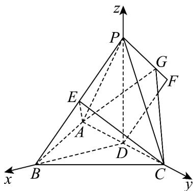

> [!faq]- 《专题04 空间向量的应用高频题型精准突破（五大题型）（高效培优期末专项训练）》官方解析
>
> > [!success]- **【答案】** (1)证明见解析 (2)1 (3) $\frac{4}{3}$ 或 $\frac{2}{3}$ .
>
> > [!note]- **【分析】**
> > （1）连接 $BD, PD$ ，证得 $AC \perp BD$ 和 $AC \perp PD$ ，利用线面垂直的判定定理，得到 $AC \perp$ 平面 $PBD$ 进而证得 $AC \perp PB$ .
> >
> > (2) 根据题意，证得 $PD \perp$ 平面 $ABC$ ，以 $D$ 为原点，建立空间直角坐标系，求得平面 $AEC$ 的法向量 $n = (1,0,-\sqrt{3})$ 和 $PF = (-\sqrt{3},0,-1)$ ，设 $G(x_2,y_2,z_2)$ 且 $PG = \lambda PF$ ，求得向量 $CG = (-\sqrt{3}\lambda,-2\sqrt{3},2-\lambda)$ ，结合向量的夹角公式，得到 $\sin \theta = \frac{\sqrt{3}}{2\sqrt{\lambda^2 - \lambda + 4}}$ ，令 $f(\lambda) = \lambda^2 - \lambda + 4$ ，利用函数的单调性，即可求解；
> >
> > (3) 由 (1) 知，平面 $AEC$ 的法向量为 $n = (1,0, -\sqrt{3})$ ，且 $G(-\sqrt{3}\lambda, 0, 2 - \lambda)$ ，再求得平面 $ACG$ 的法向量 $m = (2 - \lambda, 0, \sqrt{3}\lambda)$ ，结合向量的夹角公式，列出方程，求得 $\lambda$ 的值，即可求解。
>
> > [!note]- **【解析】**
> > （1）证明：如图所示，连接 $BD, PD$
> >
> > 因为 AB = BC 且 D 为 AC 的中点，所以 $AC \perp BD$ ，
> >
> > 又因为 PA = PC 且 D 为 AC 的中点，所以 $AC \perp PD$ ，
> >
> > 由 $BD \cap PD = D$ ，且 $BD, PD \subset$ 平面 $PBD$ ，所以 $AC \perp$ 平面 $PBD$ ，
> >
> > 又由 $PB \subset$ 平面 PBD ，所以 $AC \perp PB$ .
> >
> > $$
> > A B \perp B C
> > $$
> >
> > $$
> > A B = B C = 2 \sqrt {6}
> > $$
> >
> > $$
> > A C = \sqrt {A B ^ {2} + B C ^ {2}} = 4 \sqrt {3}
> > $$
> >
> > $$
> > A C
> > $$
> >
> > $$
> > B D = \frac {1}{2} A C = 2 \sqrt {3}
> > $$
> >
> > 在直角 $\triangle PAD$ 中，由 $PA = 4, BD = 2\sqrt{3}$ ，可得 $PD = \sqrt{PA^2 - AD^2} = 2$
> >
> > 所以 $PD^{2} + BD^{2} = PA^{2}$ ，可得 $PD \perp BD$ ，
> >
> > 因为 $AC \perp PD$ ，且 $AC \cap BD = D$ ， $AC, BD \subset$ 平面 ABC，所以 $PD \perp$ 平面 ABC，以 D 为原点，以 DB, DC, DP 所在直线分别为 x, y, z 轴，建立空间直角坐标系，如图所示，可得 $A(0, -2\sqrt{3}, 0)$ ， $C(0, 2\sqrt{3}, 0)$ ， $B(2\sqrt{3}, 0, 0)$ ， $P(0, 0, 2)$ ， $D(0, 0, 0)$ ，
> >
> > 因为 $E$ 为 $BP$ 的中点，所以 $E(\sqrt{3},0,1)$
> >
> > 则 $\overline{DC}=(0,2\sqrt{3},0),\overline{DE}=(\sqrt{3},0,1),\overline{BP}=(-2\sqrt{3},0,2)$
> >
> > 设平面 $AEC$ 的法向量为 $n = (x,y,z)$ ，则 $\left\{ \begin{array}{l} n \cdot DC = 2\sqrt{3}y = 0 \\ n \cdot DE = \sqrt{3}x + z = 0 \end{array} \right.$ ，
> >
> > 取 $x = 1$ ，可得 $y = 0, z = -\sqrt{3}$ ，所以 $n = (1, 0, -\sqrt{3})$
> >
> > 设 $F(x_{1},y_{1},z_{1})$ ，因为 $\overline{DF} = \frac{1}{2}\overline{BP}$ ，可得 $(x_{1},y_{1},z_{1}) = \frac{1}{2} (-2\sqrt{3},0,2)$
> >
> > 可得 $x_{1} = -\sqrt{3},y_{1} = 0,z_{1} = 1$ ，即 $F(-\sqrt{3},0,1)$ ，所以 $\overline{PF} = (-\sqrt{3},0, - 1)$
> >
> > 又因为 $G$ 为 $PF$ 上的动点，设 $G(x_{2},y_{2},z_{2})$ 且 $\overline{PG} = \lambda \overline{PF}$ ，且 $0\leq \lambda \leq 1$
> >
> > 可得 $(x_{2},y_{2},z_{2} - 2) = \lambda (-\sqrt{3},0, - 1)$ ，解得 $x_{2} = -\sqrt{3}\lambda ,y_{2} = 0,z_{2} = 2 - \lambda$
> >
> > 即 $G(-\sqrt{3}\lambda,0,2 - \lambda)$ ，所以 $\overline{CG} = (-\sqrt{3}\lambda , - 2\sqrt{3},2 - \lambda)$
> >
> > 设 与平面 AEC 所成角为 $\theta$ ，则 $\sin \theta = \left|\cos n, CG\right| = \frac{\left|n \cdot CG\right|}{\left|n\right|\left|CG\right|} = \frac{\sqrt{3}}{2\sqrt{\lambda^2 - \lambda + 4}}$ ，
> >
> > 设 $f(\lambda) = \lambda^2 -\lambda +4 = (\lambda -\frac{1}{2})^2 +\frac{15}{4}$ ，当 $\lambda = \frac{1}{2}$ 时， $f(\lambda)$ 取得最小值，
> >
> > 所以当 $\lambda=\frac{1}{2}$ 时， $\sin\theta$ 取得最大值，即 CG 与平面 AEC 所成角取得最大值，
> >
> > 即 $\overline{PG} = \frac{1}{2}\overline{PF}$ ，且 $\left|\overline{PF}\right| = 2$ ，所以 $PG = \left|\overline{PG}\right| = 1\cdot$
> >
> > (3) 解：由 (1) 知，平面 $AEC$ 的法向量为 $n = (1,0, -\sqrt{3})$ ，且 $G(-\sqrt{3}\lambda, 0, 2 - \lambda)$ ，所以 $\overline{DG} = (-\sqrt{3}\lambda, 0, 2 - \lambda)$ ，且 $\overline{DC} = (0, 2\sqrt{3}, 0)$ ，
> >
> > 设平面 $ACG$ 的法向量为 $m=(a,b,c)$ ，则 $\left\{\begin{aligned}m\cdot DG&=-\sqrt{3}\lambda a+(2-\lambda)c=0\\ \rightarrow &\square\square\square\square\\ m\cdot DC&=2\sqrt{3}b=0\end{aligned}\right.$
> >
> > 取 $c = \sqrt{3}\lambda$ ，可得 $x = 2 - \lambda ,b = 0$ ，所以 $\stackrel {\square}{m} = (2 - \lambda ,0,\sqrt{3}\lambda)$
> >
> > 设二面角 $E - AC - G$ 的大小为 $\alpha$ ，可得 $\cos\alpha = \left|\cos\left\langle m, n\right\rangle\right| = \frac{\left|m \cdot n\right|}{\left|m\right|\left|n\right|} = \frac{\left|2 - \lambda - 3\lambda\right|}{2 \times \sqrt{(2 - \lambda)^{2} + 3\lambda^{2}}}$
> >
> > 因为二面角 $E - AC - G$ 的余弦值为 $\frac{\sqrt{7}}{14}$ ，所以 $\frac{|2 - 4\lambda|}{2 \times \sqrt{(2 - \lambda)^{2} + 3\lambda^{2}}} = \frac{\sqrt{7}}{14}$ ，
> >
> > 整理得 $9\lambda^{2}-9\lambda+2=0$ ，解得 $\lambda=\frac{2}{3}$ 或 $\lambda=\frac{1}{3}$ ，
> >
> > 又因为 $\left|PF\right|=2$ 且 $PG=\lambda PF$
> >
> > 当 $\lambda=\frac{2}{3}$ 时，可得 $\left|\overline{PG}\right|=\frac{2}{3}\left|\overline{PF}\right|=\frac{4}{3}$ ；当 $\lambda=\frac{1}{3}$ 时，可得 $\left|\overline{PG}\right|=\frac{1}{3}\left|\overline{PF}\right|=\frac{2}{3}$
> >
> > 即 PG 的长为 $\frac{4}{3}$ 或 $\frac{2}{3}$ .
> >
> > 
