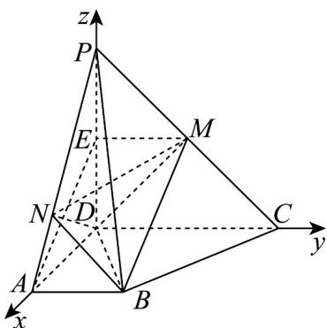

> [!faq]- 《专题04 空间向量的应用高频题型精准突破（五大题型）（高效培优期末专项训练）》官方解析
>
> > [!success]- **【答案】** (1)证明见解析； (2) $36\pi$ (3) 存在 N 为 PA 靠近 P 的 $\frac{1}{8}$ 处或中点，满足要求.
>
> > [!note]- **【分析】**
> > （1）若 $E$ 是 $PD$ 的中点，连接 $EM, AE$ ，易得四边形 $ABME$ 为平行四边形，则 $AE // BM$ ，再由线面平行的判定证明结论；
> >
> > (2) 首先注意 $P - ABD$ 是长宽高分别为 $AB, AD, PD$ 的长方体的一部分，再求出外接球的半径，即可求球体的体积；
> >
> > (3) 构建合适的空间直角坐标系，标出相关点坐标并设 $N(n,0,4 - n)$ 且 $0 < n < 4$ ，再求出 $DN$ 与平面 $MBD$ 的方向向量、法向量，应用向量法求线面角得到方程，即可得结论：
>
> > [!note]- **【解析】**
> > （1）若 $E$ 是 $PD$ 的中点，连接 $EM, AE$ ，又 $M$ 为 $PC$ 中点，则 $EM // CD$ ， $EM = \frac{1}{2} CD$ ，由 $AB // CD$ 且 $AB = \frac{1}{2} CD$ ，所以 $AB // EM$ ， $AB = EM$ ，
> >
> > 所以四边形 $ABME$ 为平行四边形，则 $AE // BM$ ， $AE \subset \text{平面 } PAD$ ， $BM \not\subset \text{平面 } PAD$ ，则 $BM // \text{平面 } PAD$ ；
> >
> > 
> >
> > (2) 由 $PD \perp$ 平面 $ABCD$ ，即 $PD \perp$ 平面 $ABD$ ， $AB \subset$ 平面 $ABD$ ，则 $PD \perp AB$ 由 $AD \perp CD$ ， $AB // CD$ ，则 $AD \perp AB$ ， $ADI\ PD = D$ 且都在平面 $PAD$ 内，所以 $AB \perp$ 平面 $PAD$ ，易知 $P - ABD$ 是长宽高分别为 $AB, AD, PD$ 的长方体的一部分，所以 $PB$ 为长方体的体对角线，且 $P - ABD$ 与该长方体的外接球重合，故 $PB = \sqrt{4^2 + 2^2 + 4^2} = 6$ 所以外接球半径 $R = \frac{PB}{2} = 3$ ，则外接球的体积为 $\frac{4}{3}\pi R^3 = 36\pi$ ；
> >
> > (3) 构建如上图示的空间直角坐标系 $D - xyz$ ，则 $B(4,2,0), M(0,2,2), N(n,0,4 - n)$ 且 $0 < n < 4$ ，所以 $\overline{DB} = (4,2,0), \overline{DM} = (0,2,2), \overline{DN} = (n,0,4 - n)$ ，
> >
> > 若 $\square m = (x, y, z)$ 是平面 $BDM$ 的一个法向量，则 $\left\{ \begin{array}{l} m \cdot DM = 2y + 2z = 0 \\ m \cdot DB = 4x + 2y = 0 \end{array} \right.$ ，取 $y = -2$ ，则 $\square m = (1, -2, 2)$ ，
> >
> > 由 与平面 所成角为 $\frac{\pi}{4}$ ，则 $\left|\cos m, DN\right| = \left|\frac{\vec{m} \cdot DN}{\left|\vec{m}\right|\left|\vec{DN}\right|}\right| = \frac{8 - n}{3 \times \sqrt{n^2 + (4 - n)^2}} = \frac{\sqrt{2}}{2}$
> >
> > 所以 $\frac{(8 - n)^2}{9(n^2 - 4n + 8)} = 1$ ，可得 $2n^{2} - 5n + 2 = 0$ ，可得 $n = \frac{1}{2}$ 或 $n = 2$
> >
> > 综上，存在 N 为 PA 靠近 P 的 $\frac{1}{8}$ 处或中点时，DN 与平面 MBD 所成角为 $\frac{\pi}{4}$ .
