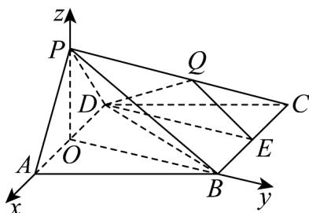

> [!faq]- 《专题04 空间向量的应用高频题型精准突破（五大题型）（高效培优期末专项训练）》官方解析
>
> > [!success]- **【答案】** $^{(1)}$ 证明见解析 (2) 存在， $\frac{PQ}{PC} = \frac{1}{3}$ 或 $\frac{3}{5}$ .
>
> > [!note]- **【分析】**
> > （1）取 $AD$ 中点 $O$ ，连接 $OP$ ， $OB$ ，结合等边三角形的性质利用线面垂直的判定定理得 $AD \perp$ 平面 $PBO$ ，进而利用线面垂直的性质定理证明即可；
> >
> > (2) 建立空间直角坐标系，设 $PQ = tPC$ ， $t \in [0,1]$ ，则 $Q\left(-2t, \sqrt{3}t, 1-t\right)$ ，求出平面 DEQ 的法向量，利用线面角的向量公式列方程求出 t，即可得解.
>
> > [!note]- **【解析】**
> > （1）证明：取AD中点O，连接OP，OB·
> >
> > $$
> > \because P A = P D, \therefore P O \perp A D
> > $$
> >
> > 在菱形 ABCD 中， $\angle BCD = 60^{\circ}$ ，可得 $\triangle BAD$ 为等边三角形，
> >
> > $\therefore BO \perp AD$ ，又∵PO， $BO \subset$ 平面PBO，且 $PO \cap BO = 0$
> >
> > $\therefore AD \perp$ 平面 $PBO, \because PB \subset$ 平面 $PBO, \therefore AD \perp PB$ .
> >
> > 
> >
> > (2) 解：∵ $PO \perp AD$ ，平面 $PAD \perp$ 平面 $ABCD$ ，平面 $PAD \cap$ 平面 $ABCD = AD$ ，且 $PO \subset$ 平面 $PAD$ ，∴ $PO \perp$ 平面 $ABCD$ ，
> >
> > 以 $O$ 为坐标原点， $OA$ ， $OB$ ， $OP$ 所在直线分别为 $x$ ， $y$ ， $z$ 轴建立如图所示空间直角坐标系，
> >
> > 则 $D(-1,0,0)$ ， $E(-1,\sqrt{3},0)$ ， $P(0,0,1)$ ， $C(-2,\sqrt{3},0)$
> >
> > 假设存在点 Q 满足题意，设 $PQ = tPC$ ， $t \in [0,1]$ ，
> >
> > 则 $\overline{OQ}=\overline{OP}+\overline{PQ}=\overline{OP}+t\overline{PC}=(0,0,1)+t(-2,\sqrt{3},-1)=(-2t,\sqrt{3}t,1-t)$
> >
> > $\therefore Q\left(-2t,\sqrt{3} t,1-t\right),\stackrel {\sqcup \sqcup \sqcup}{DE} = (0,\sqrt{3},0),\stackrel {\sqcup \sqcup \sqcup}{DQ} = (1 - 2t,\sqrt{3} t,1 - t),\stackrel {\sqcup \sqcup \sqcup}{DC} = (-1,\sqrt{3},0)$
> >
> > 设平面 DEQ 的法向量为 $n = (x, y, z)$
> >
> > 则 $\left\{ \begin{array}{l} n \cdot DE = \sqrt{3} y = 0, \\ n \cdot DQ = (1 - 2t)x + \sqrt{3} ty + (1 - t)z = 0, \end{array} \right.$
> >
> > 令 $z = 1$ ，则 $y = 0$ ， $x = \frac{t - 1}{1 - 2t}$ ， $\vec{n} = \left(\frac{t - 1}{1 - 2t},0,1\right)$
> >
> > 设 $DC$ 与平面 $DEQ$ 所成角为 $\theta$ ，则 $\sin \theta = \frac{\left|\overrightarrow{DC} \cdot \overrightarrow{n}\right|}{\left|\overrightarrow{DC}\right| \cdot \left|n\right|} = \frac{\left|\frac{1 - t}{1 - 2t}\right|}{2\sqrt{\left(\frac{t - 1}{1 - 2t}\right)^2 + 1}} = \frac{\sqrt{5}}{5}$ ，解得 $t = \frac{1}{3}$ 或 $t = \frac{3}{5}$ .
> >
> > ∴存在点 Q，使得 DC 与平面 DEQ 所成角的正弦值为 $\frac{\sqrt{5}}{5}$ ，此时 $\frac{PQ}{PC} = \frac{1}{3}$ 或 $\frac{3}{5}$ .
