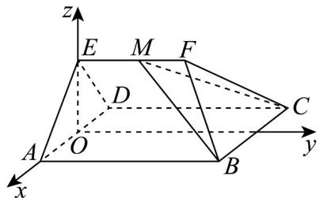

> [!faq]- 《专题04 空间向量的应用高频题型精准突破（五大题型）（高效培优期末专项训练）》官方解析
>
> > [!success]- **【答案】** (1)证明见解析 (2)证明见解析 (3) $\frac{EM}{EF} = \frac{1}{3}$
>
> > [!note]- **【分析】**
> > （1）应用线面平行判定定理证明线面平行再应用线面平行性质定理即可证明；
> >
> > (2) 应用面面垂直的性质定理证明线面垂直进而可证；
> >
> > (3) 先设 $M(0, t, \sqrt{3}), t \in [0, 3]$ ，再应用空间向量法求线面角，最后计算求参·
>
> > [!note]- **【解析】**
> > （1）∵底面ABCD是平行四边形，
> >
> > $\therefore AB // DC$ ，又 $AB \notin$ 平面 $CDEF, DC \subset$ 平面 $CDEF$
> >
> > ∴ AB // 平面 CDEF，又 $AB \subset$ 平面 ABFE，且平面 $ABFE \cap$ 平面 CDEF = EF，
> >
> > $\therefore AB // EF$ ，又 $EF \notin$ 平面 $ABCD, AB \subset$ 平面 $ABCD$
> >
> > ∴ EF // 平面 ABCD ;
> >
> > (2) 如图，取 AD 中点 O，连接 EO，又 VADE 是正三角形，
> >
> > $\therefore EO \perp AD$ ，又平面 $ADE \perp$ 平面 $ABCD$ ，平面 $ADE \cap$ 平面 $ABCD = AD$
> >
> > $\therefore EO \perp$ 平面 ABCD，又 $AB \subset$ 平面 ABCD，
> >
> > $\therefore AB \perp EO$ ，又 $AB \perp DE$ ，且 $EO \cap DE = E$ ， $EO, DE \subset$ 平面 $ADE$
> >
> > ∴ $AB \perp$ 平面 ADE ，又 $AD \subset$ 平面 ADE ，
> >
> > $\therefore AB \perp AD$ ，又四边形 $ABCD$ 为平行四边形，
> >
> > ∴ 四边形 ABCD 为矩形；
> >
> > (3) 根据题意 (2) 可以 OE 所在直线为 z 轴，以 AD 所在直线为 x 轴，以过 O 且平行 AB 的直线为 y 轴，
> >
> > 建系如图：
> >
> > 
> >
> > 则 $A(1,0,0), E(0,0,\sqrt{3}), B(1,4,0), C(-1,4,0)$ ，设 $M(0,t,\sqrt{3}), t \in [0,3]$ ，
> >
> > $$
> > \therefore \stackrel {{\square \sqcup \sqcup}} {A E} = (- 1, 0, \sqrt {3}), \stackrel {{\square \sqcup \sqcup}} {C B} = (2, 0, 0), \stackrel {{\square \sqcup \sqcup \sqcup}} {C M} = (1, t - 4, \sqrt {3}),
> > $$
> >
> > 设平面 BCM 的法向量为 $n = (x, y, z)$ ,
> >
> > 则 $\left\{ \begin{array}{l} \rightarrow \square \square \square \square \\ n \cdot CM = x + (t - 4)y + \sqrt{3}z = 0 \end{array} \right.$ 取 $n = (0, \sqrt{3}, 4 - t)$ ，
> >
> > ∴ 直线 AE 与平面 BCM 所成角的正弦值为：
> >
> > $$
> > \left| \cos \left\langle \overrightarrow {A E}, \overrightarrow {n} \right\rangle \right| = \frac {\left| \overrightarrow {A E} \cdot \overrightarrow {n} \right|}{\left| A E \right| | n |} = \frac {\sqrt {3} (4 - t)}{2 \times \sqrt {3 + (4 - t) ^ {2}}} = \frac {3}{4}, t \in [ 0, 3 ],
> > $$
> >
> > 解得 t = 1 ，
> >
> > $$
> > \therefore \frac {E M}{E F} = \frac {1}{3}.
> > $$
> >
> > ## 考点 05 用空间向量研究距离问题
