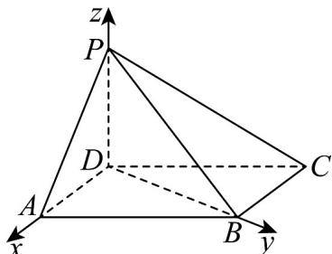

> [!faq]- 《专题04 空间向量的应用高频题型精准突破（五大题型）（高效培优期末专项训练）》官方解析
>
> > [!success]- **【答案】** (1)证明见解析(2) $-\frac{2\sqrt{7}}{7}(3)\frac{\sqrt{3}}{2}$
>
> > [!note]- **【分析】**
> > （1）利用线面垂直的判定定理和性质定理求解即可；
> >
> > (2) 以 D 为坐标原点，DA, DB, DP 为 x, y, z 轴建立坐标系，利用空间向量法求解即可.
> >
> > (3) 借助空间中点到平面距离公式计算即可得.
>
> > [!note]- **【解析】**
> > （1）因为 $\angle DAB = 60^{\circ}$ ，AB = 2AD = 2，
> >
> > 则 $DB^{2} = 4 + 1 - 2\times 2\times 1\times \cos 60^{\circ} = 3$ ，即 $DB = \sqrt{3}$
> >
> > 所以在 $\triangle ABD$ 中 $AD^{2} + DB^{2} = AB^{2}$ ，所以 $BD\perp AD$
> >
> > 因为 $PD \perp$ 底面 $ABCD$ , $BD \subset$ 平面 $ABCD$ , 所以 $PD \perp BD$
> >
> > 因为 ADI PD = D ， AD, PD ⊂ 平面 PAD ，
> >
> > 所以 $BD \perp$ 平面 PAD ，又因为 $PA \subset$ 平面 PAD ，所以 $PA \perp BD$ ；
> >
> > (2) 因为 $PD \perp$ 底面 ABCD， $AD \subset$ 平面 ABCD，所以 $PD \perp AD$
> >
> > 结合（1）可知 DP, DA, DB 两两垂直，
> >
> > 以 $D$ 为坐标原点， $DA, DB, DP$ 为 $x, y, z$ 轴建立如图所示空间直角坐标系，
> >
> > 
> >
> > 所以 $P(0,0,1)$ ， $A(1,0,0)$ ， $B(0,\sqrt{3},0)$ ， $C(-1,\sqrt{3},0)$ ，
> >
> > 所以 $\stackrel{\square\square\square}{PB}=\left(0,\sqrt{3},-1\right)$ ， $\stackrel{\square\square\square}{PA}=\left(1,0,-1\right)$ ， $\stackrel{\square\square\square}{PC}=\left(-1,\sqrt{3},-1\right)$ ，
> >
> > 设平面 APB 的法向量 $n = (x_{1}, y_{1}, z_{1})$ ,
> >
> > 则 $\left\{ \begin{array}{l}PB \cdot n = \sqrt{3} y_1 - z_1 = 0 \\ PA \cdot n = x_1 - z_1 = 0 \end{array} \right.$ ，取 $x_1 = \sqrt{3}$ ，则 $n = (\sqrt{3}, 1, \sqrt{3})$ ，
> >
> > 设平面 CPB 的法向量 $m = (x_{2}, y_{2}, z_{2})$
> >
> > 则 $\left\{\begin{aligned}&\square\square\square\\&PB\cdot m=\sqrt{3}y_{2}-z_{2}=0\\&\square\square\square\\&PC\cdot m=-x_{2}+\sqrt{3}y_{2}-z_{2}=0\end{aligned}\right.$ ，取 $y_{2}=1$ ，则 $m=\left(0,1,\sqrt{3}\right)$ ，
> >
> > 所以 $\cos n, m = \frac{n \cdot m}{|n||m|} = \frac{4}{\sqrt{7} \times 2} = \frac{2\sqrt{7}}{7}$
> >
> > 由图可知该二面角为钝角，故二面角 $A - PB - C$ 的余弦值为 $-\frac{2\sqrt{7}}{7}$
> >
> > (3) 由 (2) 知平面 $PBC$ 的法向量为 $m = (0,1,\sqrt{3})$ ， $PA = (1,0,-1)$ ，
> >
> > 所以点 A 到平面 PBC 的距离 $d = \frac{\left| PA \cdot m \right|}{\left| m \right|} = \frac{\sqrt{3}}{\sqrt{1 + 3}} = \frac{\sqrt{3}}{2}$ .
