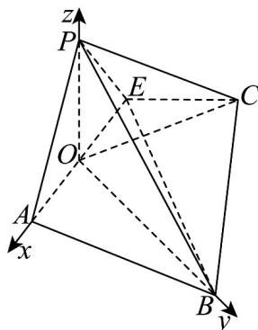

> [!faq]- 《专题04 空间向量的应用高频题型精准突破（五大题型）（高效培优期末专项训练）》官方解析
>
> > [!success]- **【答案】** (1)证明见解析 (2) $\frac{2\sqrt{22}}{11}$
>
> > [!note]- **【分析】**
> > （1）取 AE 的中点 O，证明 $OP \perp$ 平面 ABCE 即得证；
> >
> > (2) 以 O 点为原点建立空间直角坐标系，用点到平面距离的向量求法求解.
>
> > [!note]- **【解析】**
> > （1）取 $AE$ 的中点 $O$ ，连结 $OP$ ， $OC$ ，因为 $PA = PE$ ，所以 $OP \perp AE$ .
> >
> > 在 Rt△ADE 中，AD = DE = 2，所以 OP = OD = $\sqrt{2}$ ，在 △ OEC 中，
> >
> > $$
> > O C ^ {2} = O E ^ {2} + C E ^ {2} - 2 O E \cdot C E \cos 1 3 5 ^ {\circ} = (\sqrt {2}) ^ {2} + 2 ^ {2} - 2 \times \sqrt {2} \times 2 \times \left(- \frac {\sqrt {2}}{2}\right) = 1 0
> > $$
> >
> > 在 $\triangle POC$ 中， $OP = \sqrt{2}$ ， $OC = \sqrt{10}$ ， $PC = 2\sqrt{3}$ ，所以 $OP^2 + OC^2 = PC^2$ 所以 $OP \perp OC$ ，又因为 $AE \cap OC = O$ ， $AE, OC \subset$ 平面 $ABCE$ ，所以 $OP \perp$ 平面 $ABCE$ ，又 $OP \subset$ 平面 $PAE$ ，所以平面 $PAE \perp$ 平面 $ABCE$ .
> >
> > (2) 连接 OB, BE, $BE = \sqrt{BC^{2} + CE^{2}} = \sqrt{4^{2} + 2^{2}} = 2\sqrt{5}$ , $AB = \sqrt{CD^{2} + (BC - AD)^{2}} = \sqrt{4^{2} + (4 - 2)^{2}} = 2\sqrt{5}$ 又 O 为 AE 中点，
> >
> > 所以 $OB \perp AE$ ，且 $OB = \sqrt{BE^2 - OE^2} = \sqrt{20 - 2} = 3\sqrt{2}$ ，由（1）可知 $OP \perp$ 平面 $ABCE$ ，
> >
> > 又因为 $OA, OB \subset$ 平面 ABCE，
> >
> > 所以 $OP \perp OA$ ， $OP \perp OB$ ，所以 OP,OA,OB 两两垂直，
> >
> > 如图，以 O 点为原点建立如图所示的空间直角坐标系，
> >
> > 
> >
> > $$
> > O (0, 0, 0), A (\sqrt {2}, 0, 0), B (0, 3 \sqrt {2}, 0), C (- 2 \sqrt {2}, \sqrt {2}, 0), P (0, 0, \sqrt {2}), E (- \sqrt {2}, 0, 0)
> > $$
> >
> > $$
> > \stackrel {\sqcup \sqcup \sqcup} {C B} = (2 \sqrt {2}, 2 \sqrt {2}, 0), \stackrel {\sqcup \sqcup \sqcup} {P B} = (0, 3 \sqrt {2}, - \sqrt {2}), \stackrel {\sqcup \sqcup \sqcup} {E P} = (\sqrt {2}, 0, \sqrt {2})
> > $$
> >
> > 设平面 $PBC$ 的法向量为 $n = (x,y,z)$ ，则 $\left\{ \begin{array}{l} CB \cdot n = 0 \\ PB \cdot n = 0 \end{array} \right. \Rightarrow \left\{ \begin{array}{l} 2\sqrt{2} x + 2\sqrt{2} y = 0 \\ 3\sqrt{2} y - \sqrt{2} z = 0 \end{array} \right.$
> >
> > 取 $x = 1$ ，得 $y = -1, z = -3$ ，则 $n = (1, -1, -3)$
> >
> > 所以点 $E$ 到平面 $PBC$ 的距离 $d = \frac{\left|\overrightarrow{EP} \cdot \overrightarrow{n}\right|}{\left|n\right|} = \frac{\left|\sqrt{2} - 3\sqrt{2}\right|}{\sqrt{11}} = \frac{2\sqrt{22}}{11}$ .
