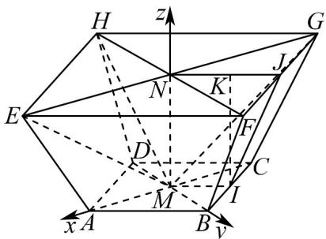

> [!faq]- 《专题04 空间向量的应用高频题型精准突破（五大题型）（高效培优期末专项训练）》官方解析
>
> > [!success]- **【答案】** (1) $\frac{\sqrt{10}}{10}$ (2) $\frac{4}{5}$
>
> > [!note]- **【分析】**
> > （1）取 $BC, FG$ 的中点 $I, J$ ， $NJ$ 的中点 $K$ ，连接 $IJ, NJ, MI, IK$ ，根据已知求得 $MN = 1$ ，构建空间直角坐标系 $M - xyz$ ，向量法求点面距离即可；
> >
> > (2) 根据 (1) 所得坐标系，应用向量法求面面角余弦值.
>
> > [!note]- **【解析】**
> > （1）取 $BC, FG$ 的中点 $I, J$ ， $NJ$ 的中点 $K$ ，连接 $IJ, NJ, MI, IK$
> >
> > 由题意可知四棱台 ABCD-EFGH 为正四棱台，
> >
> > 则 $MN \perp$ 平面ABCD，线面垂直的性质知 $MN \perp MA$ ， $MN \perp MB$ ， $MN \perp MI$
> >
> > 则 $NK = \frac{1}{2} NJ = MI$ ，且 $NK / / MI$ ，则四边形MNKI为矩形.
> >
> > 所以 $MN / / IK$ ，故 $\angle KIJ$ 为 $MN$ 与侧面所成的角.
> >
> > 因为 $MN$ 与侧面所成角为 $45^{\circ}$ ，所以 $MN = KI = KJ = \frac{1}{2} NJ = \frac{1}{4} EF = \frac{\sqrt{2}}{2}$
> >
> > 如图所示，以点 $M$ 为坐标原点，建立空间直角坐标系，
> >
> > 
> >
> > 则 $M(0,0,0)$ ， $N(0,0,\frac{\sqrt{2}}{2})$ ， $A(1,0,0)$ ， $E(2,0,\frac{\sqrt{2}}{2})$ ， $H(0,-2,\frac{\sqrt{2}}{2}),G(-2,0,\frac{\sqrt{2}}{2})$
> >
> > 所以 $\overrightarrow{MG}=\left(-2,0,\frac{\sqrt{2}}{2}\right)$ ， $\overrightarrow{MH}=\left(0,-2,\frac{\sqrt{2}}{2}\right)$ ，
> >
> > 设平面 的法向量为 $m = \left(x_{1},y_{1},z_{1}\right)$ ，则 $\begin{cases} \rightarrow \square \square \square \\ m\cdot MG = -2x_1 + \frac{\sqrt{2}}{2} z_1 = 0\\ \rightarrow \square \square \square \\ m\cdot MH = -2y_1 + \frac{\sqrt{2}}{2} z_1 = 0 \end{cases}$
> >
> > 令 $x_{1} = 1$ ，则平面 $MHG$ 的一个法向量为 $m = (1,1,2\sqrt{2})$ ，而 $\overline{MA} = (1,0,0)$
> >
> > 所以点 A 到平面 MHG 的距离 $d = \frac{\left|MA \cdot m\right|}{\left|m\right|} = \frac{\sqrt{10}}{10}$ ;
> >
> > (2) 因为 $\overrightarrow{ME} = \left(2, 0, \frac{\sqrt{2}}{2}\right)$ ，设平面 MEH 的法向量为 $\Gamma n = (x_{2}, y_{2}, z_{2})$ ，
> >
> > 则 $\left\{ \begin{array}{l} \rightarrow \square \square \square \\ n \cdot ME = 2x_2 + \frac{\sqrt{2}}{2} z_2 = 0 \\ \rightarrow \square \square \square \square \\ n \cdot MH = -2y_2 + \frac{\sqrt{2}}{2} z_2 = 0 \end{array} \right.$
> >
> > 令 $x_{2} = -1$ ，则平面MEH的一个法向量为 $n = (-1,1,2\sqrt{2})$
> >
> > 所以 $\cos\left\langle\overrightarrow{m,n}\right\rangle=\frac{\overrightarrow{m}\cdot n}{\left|\overrightarrow{m}\right|\cdot\left|n\right|}=\frac{8}{10}=\frac{4}{5}$
> >
> > 所以平面 $EHM$ 与平面 $GHM$ 夹角的余弦值为 $\frac{4}{5}$
