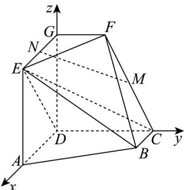

> [!faq]- 《专题04 空间向量的应用高频题型精准突破（五大题型）（高效培优期末专项训练）》官方解析
>
> > [!success]- **【答案】** $^{(1)}$ 证明见解析 $^{(2)}\frac{\sqrt{29}}{3}$
>
> > [!note]- **【分析】**
> > （1）以 $D$ 为坐标原点，建立空间直角坐标系，求出平面 $CDE$ 的法向量，再利用空间位置关系的向量证明推理即得：
> >
> > (2) 利用空间点到直线的距离公式计算即可·
>
> > [!note]- **【解析】**
> > （1）由 $AD \perp CD$ ， $DG \perp$ 平面 $ABCD$ ，得直线 $DA, DC, DG$ 两两垂直，以 $D$ 为坐标原点，直线 $DA, DC, DG$ 分别为 $x, y, z$ 轴建立空间直角坐标系，
> >
> > 
> >
> > $$
> > D (0, 0, 0), A (2, 0, 0), B (1, 2, 0), C (0, 2, 0), E (2, 0, 2), F (0, 1, 2), G (0, 0, 2), M \left(0, \frac {3}{2}, 1\right), N (1, 0, 2)
> > $$
> >
> > $DC = (0,2,0),DE = (2,0,2),MN = (1, - \frac{3}{2},1)$
> >
> > 设平面 $CDE$ 的法向量为 $n = (x,y,z)$ ，则 $\left\{ \begin{array}{l} n \cdot DC = 2y = 0 \\ n \cdot DE = 2x + 2z = 0 \end{array} \right.$ ，令 $z = -1$ ，得 $n = (1,0,-1)$ ，
> >
> > 显然 $MN \cdot n = 1 \times 1 - \frac{3}{2} \times 0 - 1 \times 1 = 0$ ，即 $MN \perp n$ ，而直线 $MN \notin$ 平面 CDE，
> >
> > 所以 $MN / /$ 平面CDE.
> >
> > (2) 由 (1) 知 $BE = (1, -2, 2), FE = (2, -1, 0)$
> >
> > 所以点 $F$ 到直线 $BE$ 的距离 $d = \sqrt{|\overrightarrow{FE}|^2 - (\frac{|\overrightarrow{FE} - \overrightarrow{BE}|}{|BE|})^2} = \sqrt{5 - (\frac{4}{3})^2} = \frac{\sqrt{29}}{3}$ .
