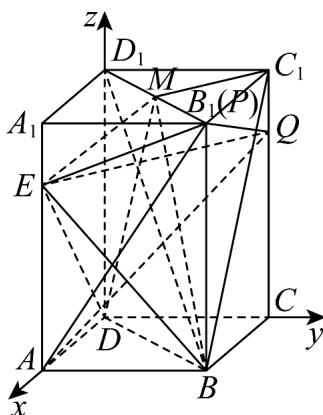

> [!faq]- 《专题04 空间向量的应用高频题型精准突破（五大题型）（高效培优期末专项训练）》官方解析
>
> > [!success]- **【答案】** AC
>
> > [!note]- **【分析】**
> > 在长方体内建立空间直角坐标系，并找出相应点的坐标·对于 $^{A}$ ，当点M为 $^{B_{1}D_{1}}$ 中点时，找出点M的坐标，计算平面 $BB_{1}D_{1}D$ 的法向量 $m^{u}$ ，得出 $C_{1}M\parallel m$ ，即可判断 $C_{1}M\perp$ 平面 $BB_{1}D_{1}D$ ；对于 $^{B}$ ，设 $P(2,2,m)$ ， $Q(0,2,n)$ ，依题意， $PE\perp BD_{1}$ ， $QE\perp BD_{1}$ ，解出m,n，计算平面APQ的法向量n，直接得到平面ABCD的法向量k，代入面面所成角的余弦值公式即可；对于 $^{C}$ ，说明 $S_{\triangle MBD}$ 为定值，点E到平面 $BB_{1}D_{1}D$ 的距离为定值，即可证明三棱锥E-BDM的体积是定值；对于 $^{D}$ ，设 $D_{1}M=\lambda D_{1}B_{1}$ ，表示出 $C_{1}M$ ，根据点到直线的距离公式写出点M到直线 $BC_{1}$ 距离的表达式，结合二次函数的最值即可得到点M到直线 $BC_{1}$ 距离的最小值·
>
> > [!note]- **【解析】**
> > 建立如图所示的空间直角坐标系 D-xyz，则有 $D(0,0,0)$ ， $A(2,0,0)$ ， $B(2,2,0)$ ， $B_{1}(2,2,4)$ ， $C_{1}(0,2,4)$ ， $D_{1}(0,0,4)$ ， $E(2,0,3)$ ，
> >
> > 
> >
> > 选项 A，当点 M 为 $B_{1}D_{1}$ 中点时， $M(1,1,4)$ ，则 $C_{1}M = (1,-1,0)$ ，有 $BB_{1} = (0,0,4)$ ， $D_{1}B_{1} = (2,2,0)$ ，
> >
> > 设平面 $BB_{1}D_{1}D$ 的法向量为 $\square m = (x,y,z)$ ，则有 $\left\{ \begin{array}{l} B B_{1} \cdot m = 4z = 0 \\ D_{1}B_{1} \cdot m = 2x + 2y = 0 \end{array} \right.$ ，
> >
> > 令 $x = 1$ ，则有 $y = -1$ ， $z = 0$ ，即 $\stackrel{\square}{m} = (1, -1, 0)$
> >
> > 有 $C_{1}M = m$ ， $C_{1}M \parallel m$
> >
> > 故 $C_{1}M \perp$ 平面 $BB_{1}D_{1}D$ ，选项A正确；
> >
> > 选项 B，设 $P(2,2,m)$ ， $Q(0,2,n)$ ，则 $\overline{PE} = (0,-2,3-m)$ ， $\overline{QE} = (2,-2,3-n)$ ，且 $\overline{BD}_{1} = (-2,-2,4)$
> >
> > 由题意可得 $PE \cdot BD_{1} = 0 \times (-2) + (-2) \times (-2) + (3 - m) \times 4 = 0$ ，解得 $m = 4$ ，
> >
> > $QE \cdot BD_{1} = 2 \times (-2) + (-2) \times (-2) + (3 - n) \times 4 = 0$ ，解得 $n = 3$ ，
> >
> > 即 $P(2,2,4)$ ， $Q(0,2,3)$ ，则 $AP = (0,2,4)$ ， $AQ = (-2,2,3)$
> >
> > 设平面 $APQ$ 的法向量为 $n = (a,b,c)$ ，则有 $\left\{ \begin{array}{l} \overrightarrow{AP} \cdot n = 2b + 4c = 0 \\ \overrightarrow{AQ} \cdot n = -2a + 2b + 3c = 0 \end{array} \right.$ ，
> >
> > 令 $b = 2$ ，则有 $a = \frac{1}{2}$ ， $c = -1$ ，即 $\vec{n} = \left(\frac{1}{2},2, - 1\right)$
> >
> > 易知平面 ABCD 的一个法向量为 $k = (0, 0, 1)$
> >
> > 则平面 与平面 所成角的余弦值为 $\left|\cos\left\langle k,n\right\rangle\right|=\left|\frac{\vec{k}\cdot\vec{n}}{\left|\vec{k}\right|\cdot\left|\vec{n}\right|}\right|=\left|\frac{-1}{\sqrt{\frac{1}{4}+4+1}}\right|=\frac{2\sqrt{21}}{21}$ ，选项 B 错误；
> >
> > 选项 C，由于 $BD \parallel B_{1}D_{1}$ ，则点 M 到直线 BD 的距离为定值，故 $S_{\triangle MBD}$ 为定值，
> >
> > 又由长方体性质可得 $AA_{1} \parallel$ 平面 $BB_{1}D_{1}D$ ，故点 E 到平面 $BB_{1}D_{1}D$ 的距离为定值，设为 h，
> >
> > 故三棱锥 $E - BDM$ 的体积 $V = \frac{1}{3} \cdot S_{\triangle MBD} \cdot h$ 为定值，选项C正确；
> >
> > 选项 D， $\overline{BC_{1}}=\left(-2,0,4\right)$ ， $\overline{C_{1}D_{1}}=\left(0,-2,0\right)$ ，设 $\overline{D_{1}M}=\lambda\overline{D_{1}B_{1}}=\left(2\lambda,2\lambda,0\right)$ ， $0\leq\lambda\leq1$
> >
> > 则 $C_1M = C_1D_1 + D_1M = C_1D_1 + \lambda D_1B_1 = (2\lambda, 2\lambda - 2, 0)$
> >
> > 故点到直线的距离 $d = \sqrt{\left|\overrightarrow{C_1M}\right|^2 - \left(\frac{\overrightarrow{C_1M} \cdot BC_1}{\left|BC_1\right|}\right)^2} = \sqrt{8\lambda^2 - 8\lambda + 4 - \frac{(-4\lambda)^2}{4 + 16}} = 2\sqrt{\frac{9}{5}\lambda^2 - 2\lambda + 1}$
> >
> > $2\sqrt{\frac{9}{5}\lambda^{2}-2\lambda+1}=2\sqrt{\frac{9}{5}\left(\lambda-\frac{5}{9}\right)^{2}+\frac{4}{9}}$ $2\sqrt{\frac{4}{9}}=\frac{4}{3}$ ，当且仅当 $\lambda=\frac{5}{9}$ 时，等号成立，
> >
> > 故点 $M$ 到直线 $BC_{1}$ 距离的最小值为 $\frac{4}{3}$ ，选项D错误·
> >
> > 故选 **AC**.
