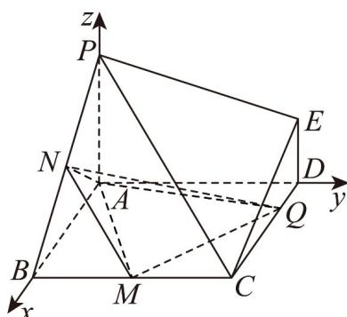

> [!faq]- 《专题04 空间向量的应用高频题型精准突破（五大题型）（高效培优期末专项训练）》官方解析
>
> > [!success]- **【答案】** BCD
>
> > [!note]- **【分析】**
> > 以点 A 为坐标原点，AB, AD, AP 所在直线分别为 x, y, z 轴，建立空间直角坐标系，假设存在点 Q 使得 $NQ \perp PB$ ，利用向量数量积为 0 求出 m 可判断 A；假设存在点 Q，使得异面直线 NQ 与 PE 所成的角为 $30^{\circ}$ ，由向量夹角公式计算可判断 B；求出平面 QMN 的法向量可判断 C；对于 D，方法一 利用向量法求出点到平面距离，再求三棱锥 Q - AMN 的体积可判断 D；方法二 利用等体积 $V_{Q-AMN} = V_{N-AMQ}$ 可判断 D。
>
> > [!note]- **【解析】**
> > 以 A 为坐标原点，以 AB, AD, AP 所在直线分别为 x, y, z 轴，
> >
> > 建立如图所示的空间直角坐标系，
> >
> > 则 $A(0,0,0),B(2,0,0),E(0,2,1),P(0,0,2),N(1,0,1),M(2,1,0)$
> >
> > 对于 A，假设存在点 $Q(m,2,0)(0<m<2)$ ，使得 $NQ \perp PB$ ，
> >
> > 因为 $NQ = (m - 1,2, - 1)$ ， $PB = (2,0, - 2)$ ，所以 $NQ\cdot PB = 2(m - 1) + 2 = 0$
> >
> > 解得 m = 0 ，不合题意，故 A 错误；
> >
> > 对于 $^{B}$ ，假设存在点 $Q(m,2,0)(0<m<2)$ ，使得异面直线NQ与PE所成的角为 $30^{\circ}$ ，
> >
> > 因为 $NQ = (m - 1, 2, -1)$ ， $PE = (0, 2, -1)$ ，
> >
> > 所以 $\left|\cos\left\langle\begin{matrix}\overrightarrow{NQ},\overrightarrow{PE}\end{matrix}\right\rangle\right|=\frac{\left|\begin{matrix}NQ\cdot PE\\ \overrightarrow{NQ}\end{matrix}\right|}{\left|\begin{matrix}NQ\end{matrix}\right|\left|PE\right|}=\frac{5}{\sqrt{(m-1)^{2}+5}\times\sqrt{5}}=\cos30^{\circ}=\frac{\sqrt{3}}{2}$
> >
> > 解得 $m = 1 \pm \frac{\sqrt{15}}{3}$ ，不符合 $0 < m < 2$ ，
> >
> > 则不存在点 $Q$ ，使得异面直线 $NQ$ 与 $PE$ 所成的角为 $30^{\circ}$ ，故 ${}^{\mathrm{B}}$ 正确；
> >
> > 对于 $^{C}$ ，当点Q运动到DC中点时， $Q(1,2,0)$ ，又 $N(1,0,1)$ ， $M(2,1,0)$
> >
> > 所以 $NQ = (0, 2, -1)$ ， $NM = (1, 1, -1)$ ，
> >
> > 设 $n_{1}^{□}=(x,y,z)$ 是平面 QMN 的法向量，
> >
> > 则 $\left\{ \begin{array}{l} n_{1} \cdot NQ = 2y - z = 0 \\ n_{1} \cdot NM = x + y - z = 0 \end{array} \right.$ ，令 $y = 1$ ，则 $n_{1} = (1,1,2)$ ，故 $C$ 正确；
> >
> > 对于 D，方法一 因为 $\overline{AN} = (1, 0, 1)$ ， $\overline{AM} = (2, 1, 0)$ ，
> >
> > 所以 $\cos\left\langle AN, AM\right\rangle = \frac{AN \cdot AM}{|AN||AM|} = \frac{2}{\sqrt{2} \times \sqrt{5}} = \frac{\sqrt{10}}{5}$
> >
> > $\sin \left\langle \overrightarrow{AN}, \overrightarrow{AM} \right\rangle = \sqrt{1 - \left( \frac{\sqrt{10}}{5} \right)^2} = \frac{\sqrt{15}}{5}$ ，则 $S_{\triangle AMN} = \frac{1}{2} \left| \overrightarrow{AN} \right| \left| \overrightarrow{AM} \right| \cdot \sin \left\langle \overrightarrow{AN}, \overrightarrow{AM} \right\rangle$
> >
> > $$
> > = \frac {1}{2} \times \sqrt {2} \times \sqrt {5} \times \frac {\sqrt {1 5}}{5} = \frac {\sqrt {6}}{2}
> > $$
> >
> > 设 $n_2 = (x_1, y_1, z_1)$ 是平面 $AMN$ 的法向量，则 $\left\{ \begin{array}{l} n_2 \cdot AN = x_1 + z_1 = 0 \\ n_2 \cdot AM = 2x_1 + y_1 = 0 \end{array} \right.$ ，
> >
> > 令 $x_{1} = 1$ ，则 $n_2^{\square \square} = (1, - 2, - 1)$ ，设 $Q(m,2,0)(0 <   m <   2)$
> >
> > 则 $AQ = (m, 2, 0)(0 < m < 2)$
> >
> > 则点 $Q$ 到平面 $AMN$ 的距离 $d = \frac{\left|AQ \cdot n_2\right|}{\left|n_2\right|} = \frac{4 - m}{\sqrt{6}}$
> >
> > 则三棱锥 $Q - AMN$ 的体积为 $\frac{1}{3} \times \frac{4 - m}{\sqrt{6}} \times \frac{\sqrt{6}}{2} = \frac{4 - m}{6}$ ，
> >
> > 因为 $0 < m < 2$ ，所以 $V_{Q - AMN} \in \left(\frac{1}{3}, \frac{2}{3}\right)$ ，故D正确.
> >
> > 方法二 设 $DQ = m(0 < m < 2)$ ，则 $CQ = 2 - m$
> >
> > 因为 $S_{\triangle AMQ} = S_{正方形ABCD} - S_{\triangle ABM} - S_{\triangle QCM} - S_{\triangle ADQ}$
> >
> > $$
> > = 4 - 1 - \frac {1}{2} (2 - m) - m = 2 - \frac {m}{2}
> > $$
> >
> > 点 $N$ 到平面 $AMQ$ 的距离 $d = \frac{1}{2} PA = 1$
> >
> > 所以 $V_{Q-AMN} = V_{N-AMQ} = \frac{1}{3}\left(2 - \frac{m}{2}\right) \times 1 = \frac{2}{3} - \frac{m}{6}$ ，因为 0 < m < 2，
> >
> > 所以 $V_{Q-AMN} \in \left( \frac{1}{3}, \frac{2}{3} \right)$ ，故 D 正确。
> >
> > 故选：BCD.
> >
> > 
