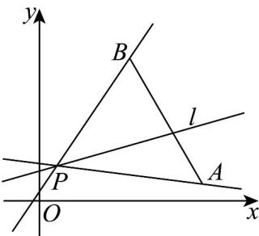

> [!faq]- 《专题05 直线的倾斜角与斜率高频题型精准突破（六大题型）（高效培优期末专项训练）》官方解析
>
> > [!success]- **【答案】** A. $\left[\frac{1}{8}, \frac{3}{2}\right]$ B. $\left[-\frac{1}{8}, \frac{3}{2}\right]$ C. $\left(-\infty, -\frac{1}{8}\right)$ D. $\left(-\infty, -\frac{1}{8}\right) \cup \left[\frac{3}{2}, +\infty\right)$
>
> > [!note]- **【分析】**
> > 由题意作图，利用斜率的计算公式，可得答案
>
> > [!note]- **【解析】**
> > 由题意作图如下：
> >
> > 
> >
> > 设直线 AP 的斜率为 $k_{AP}$ ，直线 BP 的斜率为 $k_{BP}$ ，直线 l 的斜率为 $k_{l}$ ，由图可知 $k_{AP} \leq k_{l} \leq k_{BP}$ ，
> >
> > 由 $A(9,1)$ ， $B(5,8)$ ， $P(1,2)$ ，则 $k_{AP} = \frac{1 - 2}{9 - 1} = -\frac{1}{8}$ ， $k_{BP} = \frac{8 - 2}{5 - 1} = \frac{6}{4} = \frac{3}{2}$
> >
> > 所以 $-\frac{1}{8} \leq k_{l} \leq \frac{3}{2}$ .
> >
> > 故选 **B**.
