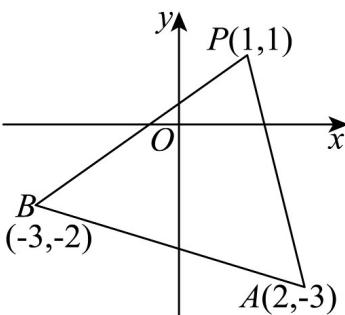

> [!faq]- 《专题05 直线的倾斜角与斜率高频题型精准突破（六大题型）（高效培优期末专项训练）》官方解析
>
> > [!success]- **【答案】** A
>
> > [!note]- **【分析】**
> > 画出图形，由题意得所求直线 l 的斜率 k 满足 $k \quad k_{PB}$ 或 $k \leq k_{PA}$ ，用直线的斜率公式求出 $k_{PB}$ 和 $k_{PA}$ 的值，求出直线 l 的斜率 k 的取值范围.
>
> > [!note]- **【解析】**
> > 解：如图所示：由题意得，所求直线 $l$ 的斜率 $k$ 满足 $k \quad k_{PB}$ 或 $k \leq k_{PA}$
> >
> > 
> >
> > $\because k_{PA} = \frac{1 - (-3)}{1 - 2} = -4, k_{PB} = \frac{1 - (-2)}{1 - (-3)} = \frac{3}{4},$
> >
> > ∴直线 l 的斜率 k 的取值范围是 $k \frac{3}{4}$ 或 $k \leq -4$ ，
> >
> > 故选 **A**.
