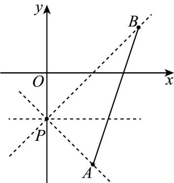

> [!faq]- 《专题05 直线的倾斜角与斜率高频题型精准突破（六大题型）（高效培优期末专项训练）》官方解析
>
> > [!success]- **【答案】** A
>
> > [!note]- **【分析】**
> > 作出图形，求出 $PA, PB$ 的斜率，数形结合可求得直线 $l$ 的斜率的取值范围，再由斜率与倾斜角的关系可求出倾斜角的取值范围·
>
> > [!note]- **【解析】**
> > 如图所示，直线 $PA$ 的斜率 $k_{PA} = \frac{-2 + 1}{1 - 0} = -1$ ，直线 $PB$ 的斜率 $k_{PB} = \frac{1 + 1}{2 - 0} = 1$ 由图可知，当直线 $l$ 与线段 $AB$ 有交点时，直线 $l$ 的斜率 $k\in [-1,1]$ ，因此直线 $l$ 的倾斜角的取值范围是 $\left[0,\frac{\pi}{4}\right]\cup \left[\frac{3\pi}{4},\pi\right)$ ：
> >
> > 故选：A.
> >
> > 
