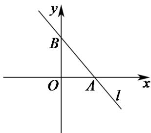

> [!faq]- 《专题06 直线方程高频题型精准突破（六大题型）（高效培优期末专项训练）》官方解析
>
> > [!success]- **【答案】** B
>
> > [!note]- **【分析】**
> > 由题意，求出点 $A$ 的横坐标、 $B$ 的纵坐标，根据三角形的面积公式建立关于 $b$ 的方程，解之即可· 【详解】如图，
>
> > [!note]- **【解析】**
> > 
> > 在 $(b + 2)x + y - 3 - b = 0(b\in \mathbf{R})$ 中
> > 令 $x = 0$ ，得 $y = 3 + b$ ；令 $y = 0$ ，得 $x = \frac{3 + b}{b + 2}$
> > 由题意，得 $3 + b > 0$ ， $\frac{3 + b}{2 + b} >0$
> > 所以VAOB的面积 $S=\frac{1}{2}\times(3+b)\times\frac{3+b}{b+2}=2$ ，
> > 即 $b^{2}+2b+1=0$ ，解得b=-1。
> >
> > 故选 **B**.
