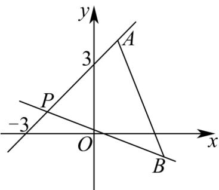

> [!faq]- 《专题06 直线方程高频题型精准突破（六大题型）（高效培优期末专项训练）》官方解析
>
> > [!success]- **【答案】** A. $\left[-\frac{2}{5}, 1\right]$ B. $\left[-1, \frac{2}{5}\right]$ C. $(- \infty, -1] \cup \left[\frac{2}{5}, +\infty\right)$ D. $\left(-\infty, -\frac{2}{5}\right] \cup [1, +\infty)$
>
> > [!note]- **【分析】**
> > 首先求出直线 l 过定点 $P(-2,1)$ ，再求出临界点处直线的斜率，结合图象得到不等式组，解得即可。
>
> > [!note]- **【解析】**
> > 因为直线 $l: mx - y + 2m + 1 = 0$ ，即 $m(x + 2) + 1 - y = 0$ ，
> >
> > 令 $\left\{ \begin{array}{l}x + 2 = 0\\ 1 - y = 0 \end{array} \right.$ ，解得 $\left\{ \begin{array}{l}x = -2\\ y = 1 \end{array} \right.$
> >
> > 所以直线 $l$ 过定点 $P(-2,1)$
> >
> > 又 $k_{AP} = \frac{4 - 1}{1 - (-2)} = 1$ ， $k_{PB} = \frac{-1 - 1}{3 - (-2)} = -\frac{2}{5}$ ，直线 $l$ 的斜率为 $m$
> >
> > 要使直线 $l$ 与线段 $AB$ 有公共点，由图可知 $-\frac{2}{5} \leq m \leq 1$ ，即 $m$ 的取值范围是 $\left[-\frac{2}{5}, 1\right]$ .
> >
> > 
> >
> > 故选 **A**
