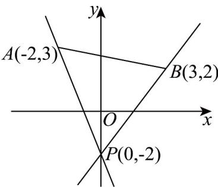

> [!faq]- 《专题06 直线方程高频题型精准突破（六大题型）（高效培优期末专项训练）》官方解析
>
> > [!success]- **【答案】** A. $\left(-\infty, -\frac{5}{2}\right) \cup \left(\frac{4}{3}, +\infty\right)$ B. $\left(-\frac{5}{2}, \frac{4}{3}\right)$ C. $\left(-\frac{4}{3}, \frac{5}{2}\right)$ D. $\left(-\infty, -\frac{4}{3}\right) \cup \left(-\frac{5}{2}, +\infty\right)$
>
> > [!note]- **【分析】**
> > 因为直线 $ax + y + 2 = 0$ 的斜率为 $-a$ ，且直线 $ax + y + 2 = 0$ 过定点 $P(0, -2)$ ，所以将直线 $ax + y + 2 = 0$ 与线段 $AB$ 没有交点时，求 $a$ 的取值范围，转化为过 $P(0, -2)$ 的直线与线段 $AB$ 没有交点时，求直线 $ax + y + 2 = 0$ 斜率的相反数问题，可得 $a$ 的取值范围·
>
> > [!note]- **【解析】**
> > 直线 $ax + y + 2 = 0$ 过定点 $P(0, -2)$ .
> >
> > 如图， $k_{PA}=\frac{3-(-2)}{-2-0}=-\frac{5}{2}$ ， $k_{PB}=\frac{2-(-2)}{3-0}=\frac{4}{3}$
> >
> > 直线 $ax + y + 2 = 0$ 与线段 $AB$ 没有交点时，直线 $ax + y + 2 = 0$ 斜率 $-a$ 满足 $-\frac{5}{2} < -a < \frac{4}{3}$
> >
> > 所以 $-\frac{4}{3}<a<\frac{5}{2}$ .
> >
> > 故选：C.
> >
> > 
