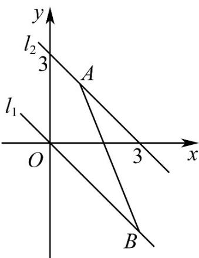

> [!faq]- 《专题07 直线交点坐标与各种距离高频题型精准突破（九大题型）（高效培优期末专项训练）》官方解析
>
> > [!success]- **【答案】** BD
>
> > [!note]- **【分析】**
> > M 集合可以看作一条挖去一点 $(2,3)$ 的直线，N 集合为一条直线，交集为空集，则 N 的直线经过 $(2,3)$ 或 M 与 N 的直线平行.
>
> > [!note]- **【解析】**
> > $\because M = \left\{(x,y)\bigg|\frac{y - 3}{x - 2} = a + 1\right\}$ ， $\therefore (2,3)\notin M$
> >
> > 将点 $(2,3)$ 代入 $(a^2 -1)x + (a - 1)y = 15$ ，得 $2(a^{2} - 1) + 3(a - 1) = 15$ ，解得 $a = -4$ （舍去）或 $a = \frac{5}{2}$
> >
> > 又当 $x \neq 2$ 时， $\frac{y - 3}{x - 2} = a + 1$ 可变形为 $(a + 1)x - y - 2a + 1 = 0$
> >
> > 当直线 $(a+1)x-y-2a+1=0$ 与 $(a^{2}-1)x+(a-1)y=15$ 平行时，
> >
> > 有 $(a-1)(a+1)=-\left(a^{2}-1\right)$ ，解得a=1或 $a=-1$ （舍去）
> >
> > 当 $a = \frac{5}{2}$ 或 $a = 1$ 时，符合题意
> >
> > 故选：BD
> >
> > 2．直线 $x + y + b = 0$ 与线段 AB 没有公共点，其中 $A(1,2)$ ， $B(3,-3)$ ，则实数 b 的取值范围是 \_\_\_\_。
> >
> > 【答案】 $(-∞,-3)∪(0,+∞)$
> >
> > 【分析】数形结合即可求得 $b$ 的取值范围·
> >
> > 【详解】由题可知，当直线 y = -x - b 经过点 $A(1,2)$ 时 b = -3 ，
> >
> > 当直线 $y = -x - b$ 经过点 $B(3, - 3)$ 时 $b = 0$
> >
> > 当直线 $x + y + b = 0$ 与线段 AB 没有公共点，
> >
> > 
> >
> > 则 b < -3 或 b > 0 .
> >
> > 故答案为： $(-∞,-3)∪(0,+∞)$ .
