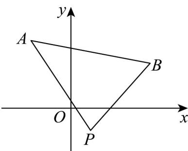

> [!faq]- 《专题07 直线交点坐标与各种距离高频题型精准突破（九大题型）（高效培优期末专项训练）》官方解析
>
> > [!success]- **【答案】** A. $(- \infty, -1) \cup \left(\frac{3}{4}, + \infty\right)$ B. $\left(-1, \frac{3}{4}\right)$ C. $\left[-1, \frac{3}{4}\right]$ D. $(- \infty, -1] \cup \left[\frac{3}{4}, + \infty\right)$
>
> > [!note]- **【分析】**
> > 判断出直线 l 所过定点 $P(1,-1)$ ，结合图象求得 m 的取值范围
>
> > [!note]- **【解析】**
> > 直线 $l: x + my + m - 1 = 0$ 恒过的定点 $P(1,-1)$ ， $k_{AP} = -\frac{4}{3}, k_{BP} = 1$ 。
> >
> > 当 m = 0 时，直线 l 方程为 x = 1，与线段 AB 有交点，符合题意。
> >
> > 当 $m \neq 0$ 时，直线 l 的斜率为 $-\frac{1}{m}$ ，则 $-\frac{1}{m} \in \left(-\infty, -\frac{4}{3}\right] \cup [1, +\infty)$ ，
> >
> > 解得 $-1 \leq m < 0$ 或 $0 < m \leq \frac{3}{4}$ ，综上， $m \in \left[-1, \frac{3}{4}\right]$ 。
> >
> > 故选：C
> >
> > 
> >
> > ## 考点 02 三线围成三角形面积问题
