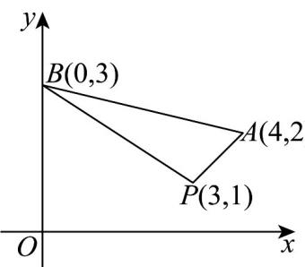

> [!faq]- 《专题07 直线交点坐标与各种距离高频题型精准突破（九大题型）（高效培优期末专项训练）》官方解析
>
> > [!success]- **【答案】** $\left(-\infty, -\frac{2}{3}\right] \cup [1, +\infty)$
>
> > [!note]- **【分析】**
> > 首先求直线所过的定点，再求边界的斜率，再利用数形结合，写出范围·
>
> > [!note]- **【解析】**
> > $mx - y - 3m + 1 = 0$ ，得 $m(x - 3) - y + 1 = 0$ ，所以直线 $l$ 过点 $P(3,1)$
> >
> > 
> >
> > $$
> > k _ {P A} = \frac {2 - 1}{4 - 3} = 1 \quad k _ {P B} = \frac {3 - 1}{0 - 3} = - \frac {2}{3}
> > $$
> >
> > 若直线 $l$ 与线段 $AB$ 有公共点，所以直线斜率 $m$ 的取值范围是 $\left(-\infty, -\frac{2}{3}\right] \cup [1, +\infty)$ .
> >
> > 故答案为： $\left(-\infty , - \frac{2}{3}\right]\cup [1, + \infty)$
