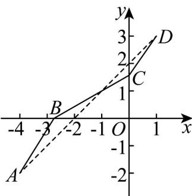

> [!faq]- 《专题07 直线交点坐标与各种距离高频题型精准突破（九大题型）（高效培优期末专项训练）》官方解析
>
> > [!success]- **【答案】** D
>
> > [!note]- **【分析】**
> > 根据两点之间的距离公式，将 $\sqrt{x^2 + 8x + 20} +\sqrt{x^2 + y^2} +\sqrt{y^2 - 6y + 10}$ 转化为点 $A(-4, - 2)$ ， $B(x,0)$ ， $C(0,y)$ ， $D(1,3)$ 之间的距离 $\left|AB\right| + \left|BC\right| + \left|CD\right|$ 的长度的和，作图分析线段和最小值情况即可得结论：
>
> > [!note]- **【解析】**
> > 因为 $\sqrt{x^2 + 8x + 20} = \sqrt{(x + 4)^2 + 4}$ 表示点 $(x,0)$ 到点 $(-4, - 2)$ 的距离， $\sqrt{x^2 + y^2}$ 表示点 $(x,0)$ 到点 $(0,y)$ 的距离， $\sqrt{y^2 - 6y + 10} = \sqrt{(y - 3)^2 + 1}$ 表示点 $(0,y)$ 到点(1,3)的距离，
> > 设 $A(-4, - 2)$ ， $B(x,0)$ ， $C(0,y)$ ， $D(1,3)$ ，则 $\sqrt{x^2 + 8x + 20} +\sqrt{x^2 + y^2} +\sqrt{y^2 - 6y + 10}$ 表示 $\left|AB\right| + \left|BC\right| + \left|CD\right|$ 的长度的和，
> >
> > 如图所示：
> >
> > 
> >
> > 当 $A, B, C, D$ 四点共线时， $\left|AB\right| + \left|BC\right| + \left|CD\right|$ 和最小为 $\left|AD\right| = \sqrt{\left(-4 - 1\right)^2 + \left(-2 - 3\right)^2} = 5\sqrt{2}$ ，故 $\sqrt{x^2 + 8x + 20} + \sqrt{x^2 + y^2} + \sqrt{y^2 - 6y + 10}$ 的最小值是 $5\sqrt{2}$ .
> >
> > 故选 **D**.
