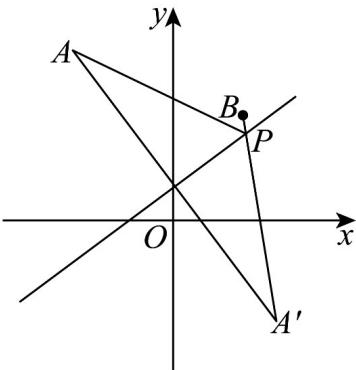

> [!faq]- 《专题07 直线交点坐标与各种距离高频题型精准突破（九大题型）（高效培优期末专项训练）》官方解析
>
> > [!success]- **【答案】** A. $\sqrt{37}$ B. $5\sqrt{5}$ C. $2\sqrt{2}$ D. 5
>
> > [!note]- **【分析】**
> > 求出对称点坐标，根据将军饮马模型即可求出最小值·
>
> > [!note]- **【解析】**
> > 设点 $A(-3,5)$ 关于直线 $3x-4y+4=0$ 的对称点 $A'(m,n)$
> >
> > 则 $\left\{ \begin{array}{l}3\times \frac{-3 + m}{2} -4\times \frac{5 + n}{2} +4 = 0\\ \frac{n - 5}{m + 3}\times \frac{3}{4} = -1 \end{array} \right.$ ，解得 $\left\{ \begin{array}{ll}m = 3 & ,\text{即}\\ n = -3 & A^{\prime}(3, - 3) \end{array} \right.$
> >
> > 连接 $A^{\prime}B$ 与直线相交于点 P，则 $\left|PA\right| + \left|PB\right|$ 的最小值为 $\left|A^{\prime}B\right| = \sqrt{(3-2)^{2} + (-3-3)^{2}} = \sqrt{37}$
> >
> > 故选：A.
> >
> > 
