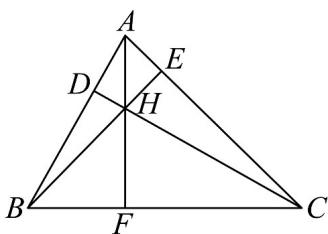
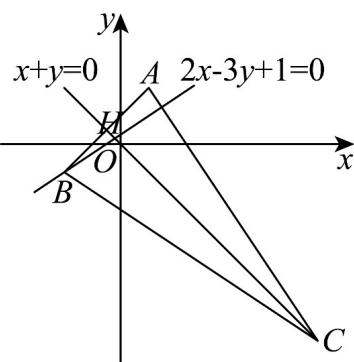

> [!faq]- 《专题07 直线交点坐标与各种距离高频题型精准突破（九大题型）（高效培优期末专项训练）》官方解析
>
> > [!success]- **【答案】** (1) $H\left(-\frac{1}{5},\frac{1}{5}\right)$ (2) $2x + 3y + 7 = 0$ (3) $\frac{9\sqrt{13}}{13}$
>
> > [!note]- **【分析】**
> > （1）联立 AB、AC 边上高所在的直线方程，解方程组得到垂心 H 的坐标.
> >
> > (2) 利用垂心性质得 $AH \perp BC$ 以确定 $BC$ 的斜率，再通过 $AC$ 与 $AC$ 边上高垂直求出 $AC$ 的方程，联立 $AC$ 与 $AB$ 边上的高得点 $C$ 坐标，最后用点斜式写出 $BC$ 的直线方程.
> >
> > (3) 根据对称点的垂直关系与中点在对称轴上的性质列方程组求出 $N$ 的坐标，再用点到直线的距离公式计算 $N$ 到 $BC$ 的距离.
>
> > [!note]- **【解析】**
> > （1）如图所示：设 $\forall ABC$ 的边 $AB$ 上的高为 $CD$ ，边 $AC$ 上的高为 $BE$ ，设 $CD: x + y = 0, BE: 2x - 3y + 1 = 0$ ，联立得 $\left\{ \begin{array}{l} x + y = 0 \\ 2x - 3y + 1 = 0 \end{array} \right.$ ，解得 $\left\{ \begin{array}{l} x = -\frac{1}{5} \\ y = \frac{1}{5} \end{array} \right.$ ，所以垂心 $H\left(-\frac{1}{5}, \frac{1}{5}\right)$ ；
> >
> > (2) $k_{AH} = \frac{2 - \frac{1}{5}}{1 - \left(-\frac{1}{5}\right)} = \frac{3}{2}$ ，由“三条高线交于一点”可得： $AH \perp BC$ ，所以 $k_{BC} = -\frac{2}{3}$ ，因为 $AC \perp BE$ ，设 $AC$ 所在直线方程为 $3x + 2y + m = 0$ ，代入 $A(1,2)$ 解得： $m = -7$ 。所以 $AC$ 所在直线方程： $3x + 2y - 7 = 0$ ，联立直线 $AC$ 与 $CD$ 的方程，可得 $\left\{ \begin{array}{l} 3x + 2y - 7 = 0 \\ x + y = 0 \end{array} \right.$ ，解得 $\left\{ \begin{array}{l} x = 7 \\ y = -7 \end{array} \right.$ ，所以 $C(7, -7)$ ，所以 $BC$ 所在直线方程： $y + 7 = -\frac{2}{3}(x - 7)$ ，整理后可得： $2x + 3y + 7 = 0$ 。
> >
> > 
> >
> > 
> >
> > （3）设 $M(-3,4)$ 关于直线 $l: x - y + 3 = 0$ 的对称点 $N(x_0, y_0)$ ，则有 $MN \perp l$ ，且的中点 $\left(\frac{x_0 - 3}{2}, \frac{y_0 + 4}{2}\right) l$ 在上，所以 $\left\{ \begin{array}{l} \frac{y_0 - 4}{x_0 + 3} = -1 \\ \frac{x_0 - 3}{2} - \frac{y_0 + 4}{2} + 3 = 0 \end{array} \right.$ ，整理得 $\left\{ \begin{array}{l} x_0 + y_0 - 1 = 0 \\ x_0 - y_0 - 1 = 0 \end{array} \right.$ ，解得 $\left\{ \begin{array}{l} x_0 = 1 \\ y_0 = 0 \end{array} \right.$ ，
> >
> > 所以 $N(1,0)$ ，所以 $N$ 到直线 BC 的距离为 $d=\frac{|2+7|}{\sqrt{13}}=\frac{9\sqrt{13}}{13}$ .
