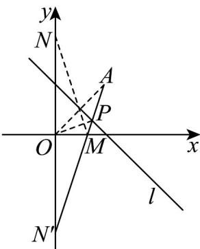

> [!faq]- 《专题07 直线交点坐标与各种距离高频题型精准突破（九大题型）（高效培优期末专项训练）》官方解析
>
> > [!success]- **【答案】** D
>
> > [!note]- **【分析】**
> > 设 N 关于 x 轴的对称点为 $N'$ ，先求出点 O 关于直线 l 的对称点 A 的坐标，再根据光学性质得到 A, P, M, $N'$ 四点共线，由 $OP + PM + MN = \sqrt{10}$ 求出 $N'$ 的坐标，进而求出直线 $AN'$ 与直线 l 的交点 P 的坐标，即可求出 k 的值。
>
> > [!note]- **【解析】**
> > 设点 O 关于直线 l 的对称点为 $A(x_1, y_1)$ ，
> >
> > 则 $\frac{x_1}{2} + \frac{y_1}{2} - 1 = 0$ 则 $\frac{y_1}{x_1}, (-1) = -1$ 得 $x_1 = 1$ ，即 $y_1 = 1$ $A(1,1)$ 设 N 关于 x 轴的对称点为 $N\Phi(0, b)$ ，由光学性质可知，A, P, M, $N'$ 四点共线，
> >
> > 所以， $AN\Phi = AP + PM + MN\Phi = OP + PM + MN = \sqrt{10}$ 又因为 $A(1,1)$ ，所以 $\sqrt{10} = \sqrt{1^2 + (1 - b)^2}$ ，解得 b = 4 或 b = -2，
> >
> > 故 $N\Phi(0,4)$ 或 $N\Phi(0,-2)$ ，
> > - **①**：当 $N\Phi(0,4)$ 时，
> >
> > 此时直线 $AN'$ 的斜率为 $\frac{4 - 1}{0 - 1} = -3$ ，直线 $AN'$ 的方程为 $y = -3x + 4$ ，
> >
> > 由 $y = -3x + 4$ ，解得 $\left\{\begin{aligned}x &= \frac{3}{2}\\ y &= -\frac{1}{2}\end{aligned}\right.$ ，所以直线与直线的交点 $P\left(\frac{3}{2}, -\frac{1}{2}\right)$ ，
> >
> > 此时 $k = k_{OP} = \frac{-\frac{1}{2}}{\frac{3}{2}} = -\frac{1}{3} < 0$ ，不符合题意，舍去；
> > - **②**：当 $N\Phi(0,-2)$ 时，
> > 此时直线 $AN'$ 的斜率为 $\frac{-2-1}{0-1}=3$ ，直线 $AN'$ 的方程为 y=3x-2，
> > 由 $y=3x-2$ ，解得 $y=\frac{1}{4}$ ，所以直线与直线的交点 $P_{4}^{2}=\frac{1}{4}$ ，此时 $k=k_{OP}=\frac{\frac{1}{4}}{\frac{3}{4}}=\frac{1}{3}$ .
> > 综上，k 的值为 $\frac{1}{3}$
> >
> > 故选：D.
> >
> > 
