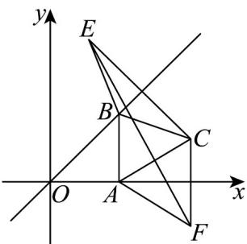

> [!faq]- 《专题07 直线交点坐标与各种距离高频题型精准突破（九大题型）（高效培优期末专项训练）》官方解析
>
> > [!success]- **【答案】** $2 \sqrt{5}$
>
> > [!note]- **【分析】**
> > 利用对称性变换 $\left|BC\right|=\left|BE\right|,\left|AC\right|=\left|AF\right|$ ，再结合两点之间线段最短，即可得最小值.
>
> > [!note]- **【解析】**
> > 
> >
> > 作点 $C(3,1)$ 关于直线 l: y = x 的对称点为 $E(1,3)$
> >
> > 再作点 $C(3,1)$ 关于 $x$ 轴的对称点为 $F(3, - 1)$
> >
> > 由VABC的周长 $l=\left|AB\right|+\left|BC\right|+\left|AC\right|=\left|AB\right|+\left|BE\right|+\left|AF\right|\quad\left|EF\right|$
> >
> > 因为 $\left|EF\right|=\sqrt{4+16}=2\sqrt{5}$
> >
> > 所以 $\forall ABC$ 的周长 $l = 2\sqrt{5}$
> >
> > 故答案为： $2 \sqrt{5}$
