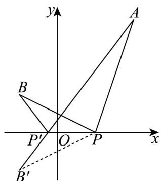

> [!faq]- 《专题07 直线交点坐标与各种距离高频题型精准突破（九大题型）（高效培优期末专项训练）》官方解析
>
> > [!success]- **【答案】** A．过点 $A(1,3)$ ， $B(-3,1)$ 的直线的倾斜角为 $30^{\circ}$ B．若直线 $2x - 3y + 6 = 0$ 与直线 $ax + y + 2 = 0$ 垂直，则 $a = \frac{3}{2}$ C. 直线 $x + 2y - 4 = 0$ 与直线 $2x + 4y + 1 = 0$ 之间的距离是 $\frac{\sqrt{5}}{2}$ D．已知 $A(2,3)$ ， $B(-1,1)$ ，点 P 在 x 轴上，则 $\left|PA\right| + \left|PB\right|$ 的最小值是 5
>
> > [!note]- **【分析】**
> > 求出直线倾斜角判断 $^{A}$ ；利用垂直关系求出a判断 $^{B}$ ；求出两条平行线间距离判断 $^{C}$ ；利用对称求出最小值判断 $^{D}$ .
>
> > [!note]- **【解析】**
> > 对于 $^{A}$ ，直线AB倾斜角为 $\alpha$ ，斜率 $k=\frac{1-3}{-3-1}=\frac{1}{2}=\tan\alpha,\quad\alpha\neq30^{\circ},^{A}$ 不正确；
> >
> > 对于 B，直线 $2x - 3y + 6 = 0$ 与直线 $ax + y + 2 = 0$ 垂直，则 $2a - 3 = 0$ ，解得 $a = \frac{3}{2}$ ，B 正确；
> >
> > 对于 C，平行线间的距离 $d=\frac{|-8-1|}{\sqrt{2^{2}+4^{2}}}=\frac{9\sqrt{5}}{10}$ ，C 不正确；
> >
> > 对于 $^{D}$ ，令点B关于x轴的对称点为 $B^{\prime}(-1,-1)$ ，
> >
> > 连结 $AB'$ 交 x 轴与 $P'$ ，P 为 x 轴上任一点，连接 $PB'$ ，
> >
> > 如图，则 $\left|PA\right|+\left|PB\right|=\left|PA\right|+\left|PB'\right|\quad\left|P'A\right|+\left|P'B\right|=\left|AB'\right|$
> >
> > 当且仅当点 P 为线段 $AB'$ 与 x 轴的交点 $P'$ 时取等号，
> >
> > $$
> > \left| A B ^ {\prime} \right| = \sqrt {(- 1 - 2) ^ {2} + (- 1 - 3) ^ {2}} = 5
> > $$
> >
> > 因此， $\left|PA\right|+\left|PB\right|$ 的最小值为 5，D 正确.
> >
> > 故选：BD
> >
> > 
