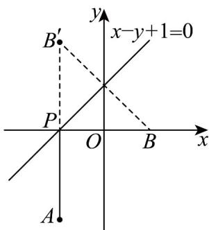

> [!faq]- 《专题07 直线交点坐标与各种距离高频题型精准突破（九大题型）（高效培优期末专项训练）》官方解析
>
> > [!success]- **【答案】** A. $\sqrt{2}$ B. $2\sqrt{2}$ C. 2 D. 4
>
> > [!note]- **【分析】**
> > 求出点 B 关于直线 $x - y + 1 = 0$ 的对称点，利用轴对称性质及两点间线段最短求出最小值。
>
> > [!note]- **【解析】**
> > 设点 $B(1,0)$ 关于直线 $x - y + 1 = 0$ 的对称点 $B'(a,b)$ ，
> >
> > 则 $\left\{\begin{aligned}\frac{b}{a-1}&=-1\\\frac{a+1}{2}-\frac{b}{2}+1&=0\end{aligned}\right.$ ，解得，即点，
> >
> > 因此 $|PA| + |PB| = |PA| + |PB'| \mid AB'| = 4$ ，当且仅当 $P$ 为线段 $AB'$ 与直线 $x - y + 1 = 0$ 的交点时取等号，所以 $|PA| + |PB|$ 的最小值是 4.
> >
> > 故选：D
> >
> > 
