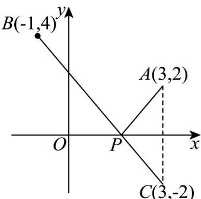

> [!faq]- 《专题07 直线交点坐标与各种距离高频题型精准突破（九大题型）（高效培优期末专项训练）》官方解析
>
> > [!success]- **【答案】** A
>
> > [!note]- **【分析】**
> > 利用对称性来求最小值，通过取等号时条件求出点的坐标·
>
> > [!note]- **【解析】**
> > 
> >
> > 根据题意，作出 $A(3,2)$ 关于 x 的对称点 $C(3,-2)$ ，
> >
> > 则 $\left|PA\right| + \left|PB\right| = \left|PC\right| + \left|PB\right|$ $\left|BC\right| = \sqrt{16 + 36} = 2\sqrt{13}$
> >
> > 当点 $P$ 与 $B, C$ 共线时等号成立，
> >
> > 则由 $C(3, -2)$ , $B(-1, 4)$ 写出直线 $BC$ 方程: $y + 2 = \frac{-2 - 4}{3 + 1} (x - 3) = -\frac{3}{2} (x - 3)$ ,
> >
> > 再令 y=0 得： $2=-\frac{3}{2}(x-3)\Rightarrow x=\frac{5}{3}$
> >
> > 故选 **A**
