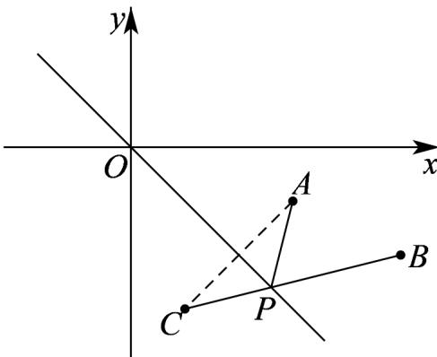

> [!faq]- 《专题07 直线交点坐标与各种距离高频题型精准突破（九大题型）（高效培优期末专项训练）》官方解析
>
> > [!success]- **【答案】** $\sqrt{17}$
>
> > [!note]- **【分析】**
> > 设点 $P(x,y)$ ，记点 $A(3,-1)$ 、 $B(5,-2)$ ，可得出
> >
> > $\sqrt{(x - 3)^2 + (y + 1)^2} + \sqrt{(x - 5)^2 + (y + 2)^2} = |PA| + |PB|$ ，结合将军饮马问题可得出所求代数式的最小值·
>
> > [!note]- **【解析】**
> > 设点 $P(x,y)$ ，记点 $A(3,-1)$ 、 $B(5,-2)$
> >
> > 则 $\sqrt{(x - 3)^2 + (y + 1)^2} +\sqrt{(x - 5)^2 + (y + 2)^2} = |PA| + |PB|$ ，如下图所示：
> >
> > 
> >
> > 点 $A$ 关于直线 $x + y = 0$ 的对称点为 $C(1, -3)$ ，由对称性可知 $\left|PA\right| = \left|PC\right|$
> >
> > 所以 $\left|PA\right| + \left|PB\right| = \left|PC\right| + \left|PB\right|$ $\left|BC\right| = \sqrt{\left(5 - 1\right)^2 + \left(-2 + 3\right)^2} = \sqrt{17}$
> >
> > 当且仅当 P 为线段 BC 与直线 $x + y = 0$ 的交点时，等号成立，
> >
> > 故 $\sqrt{(x - 3)^2 + (y + 1)^2} +\sqrt{(x - 5)^2 + (y + 2)^2}$ 的最小值为 $\sqrt{17}\cdot$
> >
> > 故答案为： $\sqrt{17}$
