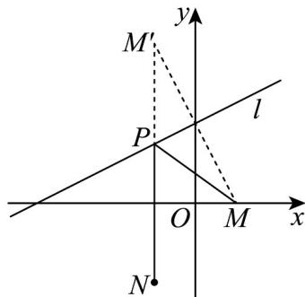
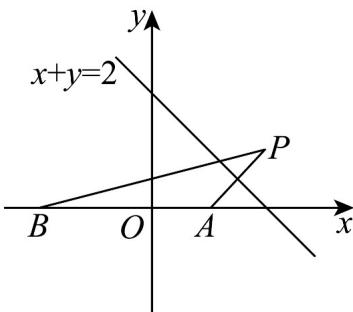

> [!faq]- 《专题07 直线交点坐标与各种距离高频题型精准突破（九大题型）（高效培优期末专项训练）》官方解析
>
> > [!success]- **【答案】** $(-2,3)$
>
> > [!note]- **【分析】**
> > 作出点 M 关于直线 l 的对称点 $M'$ ，连接 $M'N$ ，交直线 l 于 P，分析可知当 $M'$ 、P、N 三点共线时， $\left|PM\right| + \left|PN\right|$ 最小，设点 $M'(a,b)$ ，求出点 $M'$ 的坐标，进而可得出直线 $M'N$ 的方程，再将该直线方程与直线 l 的方程联立，即可得出点 P 的坐标。
>
> > [!note]- **【解析】**
> > 易知 $M(2,0)$ ， $N(-2,-4)$ 均在直线 $l$ 的同侧；
> >
> > 作出点 $M$ 关于直线 $l$ 的对称点 $M'$ ，连接 $M'N$ ，交直线 $l$ 于 $P$ ，则 $\left|PM\right| = \left|PM'\right|$
> >
> > 所以 $\left|PM\right|+\left|PN\right|=\left|PM'\right|+\left|PN\right|\quad\left|M'N\right|$
> >
> > 当 $M^{\prime}$ 、 $P$ 、 $N$ 三点共线时取等号，即 $M^{\prime}$ 、 $P$ 、 $N$ 三点共线时， $\left|PM\right| + \left|PN\right|$ 最小
> >
> > 
> >
> > 设 $M^{\prime}(a,b)$ ，则 $\left\{ \begin{array}{l} \frac{b}{a - 2} \cdot \frac{1}{2} = -1 \\ \frac{a + 2}{2} = 2 \cdot \frac{b}{2} - 8 \end{array} \right.$ ，解得 $\left\{ \begin{array}{l} a = -2 \\ b = 8 \end{array} \right.$ ，即 $M^{\prime}(-2,8)$
> >
> > 因为 $N(-2,-4)$ ，所以直线 $M'N$ 为 x = -2，
> >
> > 由 $\left\{ \begin{array}{l} x = -2 \\ x - 2y + 8 = 0 \end{array} \right.$ ，得 $\left\{ \begin{array}{l} x = -2 \\ y = 3 \end{array} \right.$ ，即 $P(-2,3)$ 。
> >
> > 故答案为： $(-2,3)$ .
> >
> > 72. 唐代诗人李颀的诗《古从军行》开头两句说：“白日登山望烽火，黄昏饮马傍交河”，诗中隐含着一个有趣的数学问题——“将军饮马”问题，即将军在观望烽火之后从山脚下某处出发，先到河边饮马后再回到军营，怎样走才能使总路程最短？在平面直角坐标系中，设军营所在的位置为 $B(-2,0)$ ，若将军从山脚下的点 $A(1,0)$ 处出发，河岸线所在直线的方程为 $x + y = 2$ ，则“将军饮马”的最短总路程为（）A. $\sqrt{29}$ B. 5 C. $\sqrt{17}$ D. $\sqrt{15}$
> >
> > 【答案】C
> >
> > <!-- source-part:2 pages:51-51 -->
> >
> > 【分析】作点 $A(1,0)$ 关于直线 $x + y = 2$ 的对称点为 $P(x,y)$ ，则最短路程为 $BP$ 。根据点关于直线的对称问题，列方程组，可求得 $P(2,1)$ ，再应用两点间的距离公式求 $|BP|$ 即可。
> >
> > 【详解】如图，作点 $A(1,0)$ 关于直线 $x + y = 2$ 的对称点为 $P(x,y)$
> >
> > 
> >
> > 则 $\left\{\begin{aligned}\frac{1+x}{2}+\frac{y}{2}=2\\\frac{y-0}{x-1}\cdot(-1)=-1\end{aligned}\right.$ ，解得 $\left\{\begin{aligned}x=2\\ y=1\end{aligned}\right.$
> >
> > 所以 $P(2,1)$ .
> >
> > 则“将军饮马”的最短总路程为 $\left|BP\right| = \sqrt{\left(2 + 2\right)^2 + \left(1 - 0\right)^2} = \sqrt{17}$ .
> >
> > 故选 **C**.
