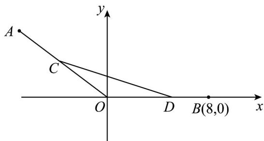

<!-- question-source:start -->
38. 如图，在平面直角坐标系 $xOy$ 中，已知点 $A(-4,3)$ ，点 $B(8,0)$ ， $C$ 、 $D$ 分别为线段 $OA$ 、 $OB$ 上的动点，且满足 $AC = BD$ .

(1) 若 $\left|BD\right|=3$ ，求点 C 的坐标；

(2) 设点 $C$ 的坐标为 $(-4m, 3m)(0 < m \leq 1)$ ，求 $\triangle OCD$ 的外接圆的一般方程，并求 $\triangle OCD$ 的外接圆所过定

点的坐标·
<!-- question-source:end -->

![[高中/课堂同步/题库/人教A版高中数学同步讲义(2026)/04_选择性必修第二册/期末/专题08 圆的两类高频题型精准突破（九大题型）（高效培优期末专项训练）/专题08_圆的两类全方位总结_六大题型/questions/answers/Q00081212A1.md]]
