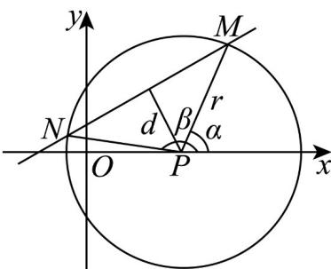

> [!faq]- 《专题08 圆的两类高频题型精准突破（九大题型）（高效培优期末专项训练）》官方解析
>
> > [!success]- **【答案】** (1) $(x-4)^{2}+y^{2}=25$ (2) $-\frac{7}{25}$
>
> > [!note]- **【分析】**
> > （1）根据条件，利用待定系数法，求出圆的一般方程，再转化成标准方程，即可求解；
> >
> > (2) 先求圆心到直线的距离，数形结合求得 $\cos\frac{\alpha-\beta}{2}=\frac{3}{5}$ ，再利用倍角公式，即可求解.
>
> > [!note]- **【解析】**
> > （1）设圆 $P$ 的一般方程为 $x^{2} + y^{2} + Dx + Ey + F = 0$
> >
> > 则 $\left\{ \begin{array}{l}3^{2} + 3E + F = 0,\\ (-3)^{2} - 3E + F = 0,\\ 4^{2} + 5^{2} + 4D + 5E + F = 0, \end{array} \right.$ 解得 $\left\{ \begin{array}{l}D = -8,\\ E = 0,\\ F = -9. \end{array} \right.$
> >
> > 所以圆 $P$ 的一般方程为 $x^{2} + y^{2} - 8x - 9 = 0$ ，故圆 $P$ 的标准方程为 $(x - 4)^{2} + y^{2} = 25$
> >
> > (2) 如图，点到直线的距离 $d=\frac{\left|\frac{\sqrt{3}}{3}\times4-0+\frac{2\sqrt{3}}{3}\right|}{\sqrt{\left(\frac{\sqrt{3}}{3}\right)^{2}+(-1)^{2}}}$ =3 $P(4,0)$ $y=\frac{\sqrt{3}}{3}(x+2)$
> >
> > 
> >
> > 又圆 $P$ 的半径 $r = 5$ ，所以 $\cos \frac{\alpha - \beta}{2} = \frac{d}{r} = \frac{3}{5}$
> >
> > 所以 $\cos(\alpha-\beta)=2\cos^{2}\frac{\alpha-\beta}{2}-1=2\times\left(\frac{3}{5}\right)^{2}-1=-\frac{7}{25}$ .
