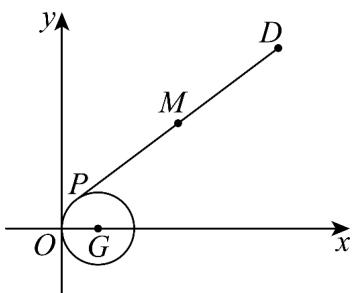

> [!faq]- 《专题08 圆的两类高频题型精准突破（九大题型）（高效培优期末专项训练）》官方解析
>
> > [!success]- **【答案】** (1) $x^{2}+y^{2}-2x=0$ (2) $4x^{2}+4y^{2}-28x-20y+73=0$ ，M 的轨迹是一个圆
>
> > [!note]- **【分析】**
> > （ $^{1}$ ）根据条件，直接求出圆心和半径，即可求解；
> >
> > (2) 画出图形，运用相关点法求解即可·
>
> > [!note]- **【解析】**
> > （1）直线 $mx - y - m = 0$ 恒过点 $(1,0)$
> >
> > 因为圆 G 恒被直线 $mx - y - m = 0 (m \in \mathbb{R})$ 平分，所以 $mx - y - m = 0$ 恒过圆心，
> >
> > 所以圆心坐标为 $(1,0)$ ，又圆G经过点 $A(0,0)$ ，
> >
> > 所以圆的半径 r=1 ，所以圆 G 的方程为 $\left(x-1\right)^{2}+y^{2}=1$ ，即 $x^{2}+y^{2}-2x=0$
> >
> > (2) 设 $M(x,y)$ ，因为 M 为线段 DP 的中点，所以 $P(2x-6,2y-5)$
> >
> > 因为点 $P$ 是圆 $G$ 上的动点，所以 $(2x - 6)^2 + (2y - 5)^2 - 2 \times (2x - 6) = 0$
> >
> > 即 $4x^{2} + 4y^{2} - 28x - 20y + 73 = 0$
> >
> > 所以 $M$ 的轨迹是一个圆·
> >
> > 
