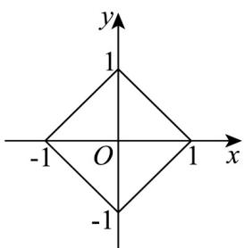
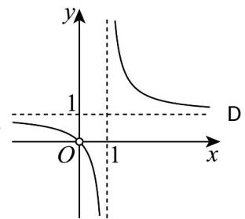

> [!faq]- 《专题08 圆的两类高频题型精准突破（九大题型）（高效培优期末专项训练）》官方解析
>
> > [!success]- **【答案】** A  B  C  
>
> > [!note]- **【分析】**
> > 分别取 $n = 12, -1$ 求解即可.
>
> > [!note]- **【解析】**
> > 解：当 n=1 时，方程为： $x+y=1$ ，对应的图象为选项 A，
> >
> > 当 $n = 2$ 时，方程为： $x^{2} + y^{2} = 1$ ，对应的图象为选项B，
> >
> > 当 $n = -1$ 时，方程为： $x^{-1} + y^{-1} = 1$
> >
> > 得 $y = \frac{1}{1 - \frac{1}{x}} = \frac{x}{x - 1} = 1 + \frac{1}{x - 1}$ ，对应的图象为选项 C，
> >
> > 选项 $^{D}$ 图形是四条线段，没有方程与之对应，
> >
> > 故选 **D**
