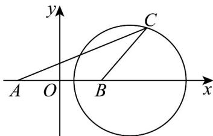

> [!faq]- 《专题08 圆的两类高频题型精准突破（九大题型）（高效培优期末专项训练）》官方解析
>
> > [!success]- **【答案】** D
>
> > [!note]- **【分析】**
> > 根据正弦定理，利用几何法，结合圆的定义和性质进行求解即可·
>
> > [!note]- **【解析】**
> > 由 $\frac{\sin B}{\sin A} -\frac{2\sin A}{\sin B} = 1$ ，得 $\sin^2 B - \sin A\sin B - 2\sin^2 A = 0$
> >
> > 即 $\left(\sin B - 2\sin A\right)\left(\sin B + \sin A\right) = 0$
> >
> > 因为 $\sin B + \sin A\neq 0$
> >
> > 所以 $\sin B - 2\sin A = 0$
> >
> > 所以 b=2a ，即 CA=2CB ；由 c=6 ，得 AB=6 .
> >
> > 以线段 AB 中点为坐标原点，直线 AB 为 x 轴建立平面直角坐标系.
> >
> > 则 $A(-3,0)$ ， $B(3,0)$ ，设 $C(x,y)$
> >
> > 所以 $\sqrt{(x+3)^{2}+(y-0)^{2}}=2\sqrt{(x-3)^{2}+(y-0)^{2}}$
> >
> > 化简得 $(x-5)^{2}+y^{2}=16$ .
> >
> > 所以点的 C 轨迹是以 $(5,0)$ 为圆心，以 4 为半径的圆（不包括和 x 轴的两个交点）.
> >
> > 故VABC的最大面积为 $\frac{1}{2}\times6\times4=12$ ·此时 $C(5,4)$ 或 $C(5,-4)$ ，
> >
> > $$
> > b = | A C | = \sqrt {(- 3 - 5) ^ {2} + (0 \pm 4) ^ {2}} = 4 \sqrt {5}
> > $$
> >
> > $$
> > a = | B C | = \sqrt {(3 - 5) ^ {2} + (0 \pm 4) ^ {2}} = 2 \sqrt {5}
> > $$
> >
> > 故VABC 面积取最大值时，
> >
> > $$
> > \cos C = \frac {a ^ {2} + b ^ {2} - c ^ {2}}{2 a b} = \frac {(2 \sqrt {5}) ^ {2} + (4 \sqrt {5}) ^ {2} - 6 ^ {2}}{2 \times 2 \sqrt {5} \times 4 \sqrt {5}} = \frac {4}{5}.
> > $$
> >
> > 故选：D
> >
> > 
