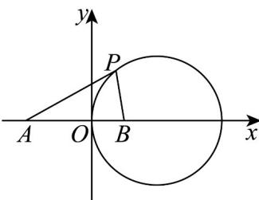
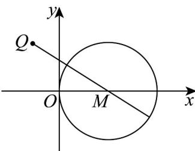

> [!faq]- 《专题08 圆的两类高频题型精准突破（九大题型）（高效培优期末专项训练）》官方解析
>
> > [!success]- **【答案】** (1) $x^{2}+y^{2}-4x=0$ (2)最小值是 $\sqrt{13} - 2$ ，最大值是 $\sqrt{13} + 2$
>
> > [!note]- **【分析】**
> > （1）设 $P(x,y)$ ，由 $\frac{|PA|}{|PB|} = \frac{\sqrt{(x + 2)^2 + y^2}}{\sqrt{(x - 1)^2 + y^2}} = 2$ ，整理可得 $(x - 2)^2 +y^2 = 4$
> >
> > (2) 由圆心 $M(2,0)$ ，半径是 $2$ ，先判断 $|QM| > 2$ 即 $Q(-1,2)$ 在圆外，故 $|PQ|$ 的最小值为 $|QM| - r$ ，最大值为 $|QM| + r$ .
>
> > [!note]- **【解析】**
> > （1）
> >
> > 
> >
> > 设动点 $P(x,y)$ ，则 $\frac{|PA|}{|PB|} = \frac{\sqrt{(x + 2)^2 + y^2}}{\sqrt{(x - 1)^2 + y^2}} = 2$
> >
> > 即 $\left(x + 2\right)^2 +y^2 = 4\left(x - 1\right)^2 +4y^2$ ，整理得 $\left(x - 2\right)^2 +y^2 = 4$
> >
> > 故动点 P 的轨迹 E 的方程为 $(x-2)^{2}+y^{2}=4$ ，该轨迹是以 $(2,0)$ 为圆心，以 2 为半径的圆·(2)
> >
> > 
> >
> > 由（1）可知 $E:(x - 2)^{2} + y^{2} = 4$ ，半径是2，圆心 $M(2,0)$
> >
> > 因 $\left|QM\right|=\sqrt{9+4}=\sqrt{13}>2$ ，故 $Q(-1,2)$ 在圆外，
> >
> > 故 $\left|PQ\right|$ 的最小值是 $\sqrt{13}-2$ ，最大值是 $\sqrt{13}+2$ ·
