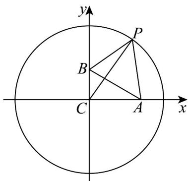

> [!faq]- 《专题08 圆的两类高频题型精准突破（九大题型）（高效培优期末专项训练）》官方解析
>
> > [!success]- **【答案】** [250,850]
>
> > [!note]- **【分析】**
> > 建立如图所示的平面直角坐标系，设 $P(15\cos \theta ,15\sin \theta)$ ， $\theta \in \mathbb{R}$ ，用 $\theta$ 表示 $l^2 +m^2$ 后利用三角变换公式及正弦函数的性质可求其取值范围·
>
> > [!note]- **【解析】**
> > 
> >
> > 如图，在 RtABC 中， $\angle BCA = 90^{\circ}, \angle BAC = 30^{\circ}, \angle CBA = 60^{\circ}$ ，
> >
> > $\left|CP\right| = 15$ ，建立如图所示的平面直角坐标系，则 $\left|AC\right| = 5\sqrt{3}$ ， $\left|BC\right| = 5$
> >
> > 故 $C(0,0), A(5\sqrt{3},0), B(0,5)$ ，设 $P(15\cos \theta, 15\sin \theta)$ ， $\theta \in \mathbb{R}$
> >
> > 则 $l^2 + m^2 = (15\cos \theta - 5\sqrt{3})^2 + (15\sin \theta)^2 + (15\cos \theta)^2 + (15\sin \theta - 5)^2$ $= 225 \times 2 + 100 - 150(\sqrt{3}\cos \theta + \sin \theta)$ $= 550 - 300\sin \left(\theta + \frac{\pi}{3}\right)$ ，
> >
> > 因为 $\theta \in \mathbb{R}$ ，故 $-1\leq \sin \left(\theta +\frac{\pi}{3}\right)\leq 1$ ，故 $250\leq l^2 +m^2\leq 850$
> >
> > 故答案为： $[250,850]$
> >
> > 55. 方程 $x^{2} + y^{2} + 4x - 2y + 5m = 0$ 表示圆，则 $m$ 的范围是（）A. $m > 1$ B. $m < 1$ C. $m \leq 1$ D. $m \leq 1$
> >
> > 【答案】B
> >
> > 【分析】根据方程 $x^{2} + y^{2} + Dx + Ey + F = 0$ 表示圆，应当满足 $D^{2} + E^{2} - 4F > 0$ 求解即可.
> >
> > 【详解】因为方程 $x^{2} + y^{2} + 4x - 2y + 5m = 0$ 表示圆，
> >
> > 所以 $4^{2} + (-2)^{2} - 4 \times 5m > 0$ ，解得： $m < 1 \cdot$
> >
> > 故选 **B**.
