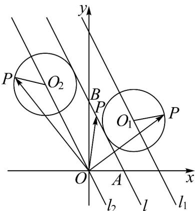

> [!faq]- 《专题08 圆的两类高频题型精准突破（九大题型）（高效培优期末专项训练）》官方解析
>
> > [!success]- **【答案】** A．若点 P 在直线 AB 上运动，当 $\lambda\mu$ 取得最大值时， $|OP|$ 的值为 $\sqrt{5}$ B．若点 P 在直线 AB 上运动， $\stackrel{\square}{OA}$ 在 $\stackrel{\square}{OP}$ 上的投影的数量的取值范围是 $(- \frac{\sqrt{5}}{5}, 1]$ C．若点 P 在以 $r = \frac{2\sqrt{5}}{5}$ 为半径且与直线 AB 相切的圆上， $|OP|$ 取得最大值时， $\lambda + \mu$ 的值为 3 D．若点 P 在以 $r = \frac{2\sqrt{5}}{5}$ 为半径且与直线 AB 相切的圆上， $\lambda + \mu$ 的范围是 [-1,3]
>
> > [!note]- **【分析】**
> > 根据给定条件，以点 O 为坐标原点建立平面直角坐标系，求出点 P 的坐标，逐项分析点 P 的轨迹并推理计算、判断作答.
>
> > [!note]- **【解析】**
> > 因为 $OA \cdot OB = 0$ ，即有 $OA \perp OB$ ，则以点 O 为坐标原点，OA, OB 的方向分别为 x, y 轴的正方向，建立平面直角坐标系，
> >
> > 
> >
> > 则 $A(1,0),B(0,2)$ ，由 $\overline{OP} = \lambda \overline{OA} +\mu \overline{OB}$ ，得 $P(\lambda ,2\mu)$
> >
> > 点 $A, B$ 确定的直线 $l$ 方程为： $\frac{x}{1} + \frac{y}{2} = 1$ ，即 $2x + y = 2$ ，
> >
> > 当点 $P$ 在直线 $l$ 上时， $2\lambda + 2\mu = 2$ ，即 $\mu = 1 - \lambda$ ， $\lambda\mu = \lambda(1 - \lambda) = -\left(\lambda - \frac{1}{2}\right) + \frac{1}{4}$ ，
> >
> > 因此当 $\mu = \lambda = \frac{1}{2}$ 时， $\lambda \mu$ 取得最大值 $\frac{1}{4}$ ，此时 $P(\frac{1}{2}, 1)$ ， $|\overrightarrow{OP}| = \sqrt{(\frac{1}{2})^2 + 1^2} = \frac{\sqrt{5}}{2}$ ，A 错误；
> >
> > 在 上的投影的数量 $m=\frac{\overline{OA}\cdot\overline{OP}}{|OP|}=\frac{\lambda}{\sqrt{\lambda^{2}+(2\mu)^{2}}}=\frac{\lambda}{\sqrt{5\lambda^{2}-8\lambda+4}}$ 当时， $m = 0$ ， $\lambda >0$ 时， $m = \frac{1}{\sqrt{\left(\frac{2}{\lambda} - 2\right)^2 + 1}}\leq 1$ ，当且仅当时取等号，即 $0 <   m\leq 1$
> >
> > 当时， $m = -\frac{1}{\sqrt{\frac{4}{\lambda^2} - \frac{8}{\lambda} + 5}} > -\frac{\sqrt{5}}{5}$ 因为 $\frac{4}{\lambda^2} -\frac{8}{\lambda} +5 > 5$ 恒成立，则 $-\frac{\sqrt{5}}{5} < m < 0$
> >
> > 所以 $-\frac{\sqrt{5}}{5} < m \leq 1$ ，即 $\square OA$ 在 $\square OP$ 上的投影的数量的取值范围是 $(- \frac{\sqrt{5}}{5}, 1]$ ， $B$ 正确；
> >
> > 当点 $P$ 在以 $r = \frac{2\sqrt{5}}{5}$ 为半径且与直线 $AB$ 相切的圆上时，因为与直线 $AB$ 相切，
> >
> > 且半径为 $\frac{2\sqrt{5}}{5}$ 的圆的圆心轨迹是与直线 $AB$ 平行，到直线 $AB$ 距离为 $\frac{2\sqrt{5}}{5}$ 的两条平行直线，
> >
> > 设这两条与 $AB$ 平行的直线方程为 $2x + y = t, t \neq 2$ ，则 $\frac{|t - 2|}{\sqrt{2^2 + 1^2}} = \frac{2}{\sqrt{5}}$ ，解得 $t = 4$ 或 $t = 0$ ，
> >
> > 因此动圆圆心的轨迹为直线 $l_{1}:2x + y = 4$ 或直线 $l_{2}:2x + y = 0$
> >
> > 设圆心为 $(a,b)$ ，则点 $P$ 在圆 $(x - a)^2 + (y - b)^2 = \frac{4}{5}$ 上，其中 $2a + b = 4$ 或 $2a + b = 0$ ，
> >
> > 于是令 $\left\{ \begin{array}{l} \lambda = a + \frac{2}{\sqrt{5}}\cos \theta \\ 2\mu = b + \frac{2}{\sqrt{5}}\sin \theta \end{array} (\theta \in \mathbb{R}) \right.$
> >
> > $$
> > | \overrightarrow {O P} | = \sqrt {(a + \frac {2}{\sqrt {5}} \cos \theta) ^ {2} + (b + \frac {2}{\sqrt {5}} \sin \theta) ^ {2}} = \sqrt {a ^ {2} + b ^ {2} + \frac {4}{5} + \frac {4}{\sqrt {5}} (a \cos \theta + b \sin \theta)}
> > $$
> >
> > $\sqrt{a^2 + b^2 + \frac{4}{5} - \frac{4}{\sqrt{5}}\sqrt{a^2 + b^2}} = |\sqrt{a^2 + b^2} - \frac{2}{\sqrt{5}}|$ ，显然点 $(a,b)$ 是直线 $l_1$ 或 $l_2$ 上任意一点，
> >
> > 即 $a, b \in \mathbb{R}$ ，从而 $\sqrt{a^2 + b^2}$ 无最大值，即 $|\overline{OP}|$ 无最大值，C 错误；
> >
> > $\lambda + \mu = a + \frac{b}{2} + \frac{2}{\sqrt{5}} \cos \theta + \frac{1}{\sqrt{5}} \sin \theta = a + \frac{b}{2} + \sin (\theta + \varphi)$ ，其中锐角 $\varphi$ 满足 $\tan \varphi = 2$ ，
> >
> > 显然 $-1 \leq \sin (\theta + \varphi) \leq 1$ ，当圆心 $(a, b)$ 在直线 $l_2$ 时， $2a + b = 0$ ，则 $\lambda + \mu = \sin (\theta + \varphi) \in [-1, 1]$
> >
> > 当圆心 $(a,b)$ 在直线 $l_{1}$ 时， $2a + b = 4$ ，则 $\lambda + \mu = 2 + \sin (\theta + \varphi) \in [1,3]$ ，
> >
> > 所以 $\lambda + \mu$ 的范围是 $[-1, 3]$ ，D 正确.
> >
> > 故选：BD
> >
> > 57. 阿波罗尼斯证明过这样一个命题：平面内到两定点距离之比为常数的点的轨迹是圆，后人将这个圆称为阿波罗尼斯圆·若平面内两定点 $A$ ， $B$ 间的距离为 $3$ ，动点 $P$ 满足 $\frac{|PA|}{|PB|} = 2$ ，则 $\overline{PA} \cdot \overline{PB}$ 的范围为 \_\_\_\_.
> >
> > 【答案】 $[-2,18]$
> >
> > 【分析】以 AB 中点为原点 O，以 AB 所在直线为 x 轴，以 AB 的垂直平分线为 y 轴，建立平面直角坐标系 xOy，则 $A\left(-\frac{3}{2},0\right)$ ， $B\left(\frac{3}{2},0\right)$ ·设 $P(x,y)$ ，由题可得点 P 轨迹方程，后可得答案·
> >
> > 【详解】以 AB 中点为原点 O，以 AB 所在直线为 x 轴，以 AB 的垂直平分线为 y 轴，建立平面直角坐标系 xOy，
> >
> > 因为 $|AB|=3$ ，所以 $A\left(-\frac{3}{2},0\right)$ ， $B\left(\frac{3}{2},0\right)$ .
> >
> > 设 $P(x,y)$ ，因为 $\frac{|PA|}{|PB|} = 2$ ，所以 $\sqrt{\left(x + \frac{3}{2}\right)^2 + y^2} = 2\cdot \sqrt{\left(x - \frac{3}{2}\right)^2 + y^2}$
> >
> > 整理得 $x^{2} + y^{2} - 5x + \frac{9}{4} = 0$ ，即 $\left(x - \frac{5}{2}\right)^2 +y^2 = 4$
> >
> > $$
> > y ^ {2} = 4 - \left(x - \frac {5}{2}\right) ^ {2} \quad 0 \Rightarrow x \in \left[ \frac {1}{2}, \frac {9}{2} \right].
> > $$
> >
> > 又 $\overset{[1]}{PA} = \left(-\frac{3}{2} - x, -y\right) \overset{[1]}{PB} = \left(\frac{3}{2} - x, -y\right)$ ,
> >
> > 则 $\overrightarrow{PA} \cdot \overrightarrow{PB} = x^2 + y^2 - \frac{9}{4} = x^2 + 4 - \left(x - \frac{5}{2}\right)^2 - \frac{9}{4} = 5x - \frac{9}{2}$ ，则 $\overrightarrow{PA} \cdot \overrightarrow{PB} \in [-2, 18]$ .
> >
> > 故答案为： $[-2,18]$
