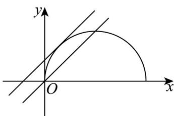

> [!faq]- 《专题09 直线与圆及圆与圆的位置关系高频题型精准突破（九大题型）（高效培优期末专项训练）》官方解析
>
> > [!success]- **【答案】** B
>
> > [!note]- **【分析】**
> > 曲线表示以 $C(1,0)$ 为圆心、半径等于 1 的半圆，当直线 y = x - m 过点 $(0,0)$ 时，可得 m = 0 ，满足条件；当直线 y = x - m 和半圆相切时，由 $1 = \frac{|1 - 0 - m|}{\sqrt{1 + 1}}$ ，得 $m = 1 - \sqrt{2}$ ，数形结合可得实数 m 的取值范围．
>
> > [!note]- **【解析】**
> > 将 $y = \sqrt{2x - x^{2}}$ 两边平方整理得 $(x - 1)^{2} + y^{2} = 1(y - 0)$ ，
> >
> > 即曲线 $y = \sqrt{2x - x^{2}}$ 表示以 $C(1,0)$ 为圆心、半径等于 $^{1}$ 的半圆，如图所示：
> >
> > 
> >
> > 当 $y = x - m$ 过点 $(0,0)$ 时， $m = 0$ ，满足 $y = x - m$ 与 $y = \sqrt{2} x - x^2$ 有两个不同的公共点；
> >
> > 当直线 y = x - m 和半圆相切时，由 $1 = \frac{|1 - 0 - m|}{\sqrt{1 + 1}}$ ，得 $m = 1 - \sqrt{2}$ 或 $m = 1 + \sqrt{2}$ ，
> > 由图知，此时纵截距 -m > 0，即 m < 0，所以 $m = 1 - \sqrt{2}$ ，
> > 故直线 y = x - m 与曲线 $y = \sqrt{2x - x^{2}}$ 有两个不同的公共点时，
> > 实数 m 的取值范围为 $(1-\sqrt{2},0]$ .
> >
> > 故选 **B**
